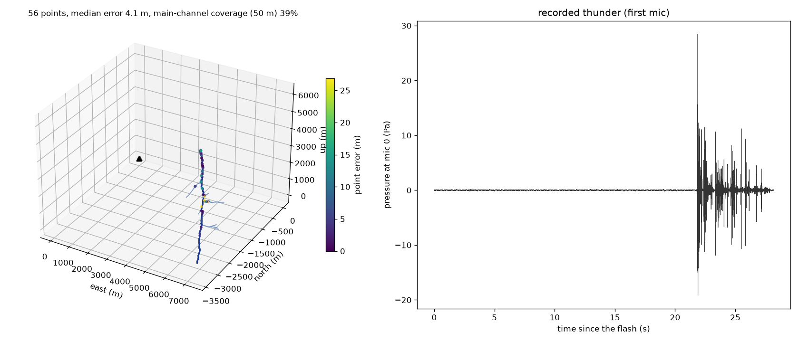

# thunder: reconstructing lightning in 3D from the sound of thunder

Thunder is an acoustic recording of the lightning channel: every few meters of the channel emits a pressure pulse, and those pulses reach different microphones at slightly different times. This project is a simulation framework that

1. **generates** realistic lightning channels (tortuous, branched, in-cloud, multi-stroke),
2. **synthesizes** the thunder a microphone array would record: a physical source model, propagation through a stratified, windy atmosphere by exact ray tracing, atmospheric absorption, ground reflection, and realistic sensors (mic responses, noise, clock and position errors),
3. **reconstructs** the 3D channel from the recordings with four methods, and
4. **evaluates** against the ground truth in paired Monte Carlo experiments with bootstrap confidence intervals.

The reconstruction code never sees the ground truth; a test enforces this.



*One bolt from `configs/base.yaml`. Left: the true channel (lines) and the reconstructed points colored by error. Right: the thunder recorded at one microphone.*

## Quickstart

```bash
uv venv --python 3.12 && source .venv/bin/activate   # or: python3.12 -m venv .venv && source .venv/bin/activate
uv pip install -e ".[dev]"                           # or: pip install -e ".[dev]"
python scripts/run_experiment.py configs/base.yaml   # one bolt end to end, ~10 s (first run ~1-2 min: caches)
```

This writes `results/base/<run_id>/`:
- `figures/reconstruction.png` and an interactive `figures/reconstruction.html`;
- the recorded thunder as WAV files (`audio/`);
- all metrics (`metrics.json`);
- the resolved config, seed and git commit, for reproducibility.

```bash
pytest                    # 200+ tests, ~2-3 min (slow tests: pytest -m slow)
ruff check . && mypy src  # lint and types
```

## What's inside

| Stage | Highlights |
| --- | --- |
| Channel generator (`thunder.channel`) | Biased random walk with the measured turn-angle distribution, recursive branching, in-cloud sections, multiple strokes |
| Thunder synthesis (`thunder.acoustics`) | Few's N-wave source with energy-calibrated amplitude, sub-segment tortuosity, exact continuous deposition on an oversampled grid |
| Atmosphere (`thunder.atmosphere`) | Stratified temperature, humidity and power-law wind; exact eigenray solver (validated against an ODE ray tracer); refraction shadow zones; ISO 9613-1 absorption; ground reflection |
| Sensors (`thunder.sensors`) | Array layouts; mic response presets (measurement to phone); coherent ambient, wind and rain noise; clock offsets and drift; position and flash-time errors |
| Reconstruction (`thunder.recon`) | **A** plane-wave TDOA (two-pass β-PHAT GCC, constrained slowness fit). **B** steered response power, several sources per window. **C** absolute-time multilateration through any atmosphere. **D** Bayesian: calibrated error ellipsoids, plus self-calibration of the sound speed, wind and the array itself, jointly over several bolts |
| Evaluation (`thunder.eval`, `thunder.experiments`) | Point error, coverage, angular, branch and strike-point metrics, uncertainty calibration; paired Monte Carlo with common random numbers and a stage cache; cluster bootstrap CIs |

## Key results

All experiments use the same bolts across compared variants (paired), realistic sensors and 95% bootstrap CIs. Write-ups with figures are in [`docs/results/`](docs/results).

| | Finding |
| --- | --- |
| **E1** sanity | Ideal conditions: 1.4 m median point error |
| **E2** array design | Symmetric layouts (square + center, rings) at about 50 m are best: about 0.04° direction error, about 3 m at 1–3 km. A **surrogate built from geometry alone** (Cramér–Rao bound over the channel's directions, plus the wavefront-curvature bias of plane-wave methods on asymmetric layouts) ranks 20 layouts like full simulation (Spearman ρ = 0.98) |
| **E3** error budget | For 20 m median error: clocks within about 0.4 ms, mic positions within about 12 cm, temperature within about 2.5 K, wind known to about 0.7 m/s. Unknown wind costs about 26 m per m/s |
| **E4** methods | With the true atmosphere, Methods A–C reach 3.0–3.3 m; B recovers the most channel (86% of the main channel, 57% of branches). With the wind unknown, every method sits near 130 m: the atmosphere matters about 40× more than the method |
| **E5** limits | Direction accuracy holds to 15 km (about 0.035°). Coverage drops below 50% near 11 km, from the refraction shadow and overlapping arrivals, not noise |
| **E6** four phones | As-is (phone GPS positions, hand-clap sync): about 0.5 km error. Tape-measured positions plus 0.1 ms sync reach professional-kit quality (180 m vs 165 m, wind-limited); with the atmosphere known, about 25 m |
| **E7** self-calibration | Method D recovers the sound-speed profile and gives honest error bars on realistic data (2σ coverage 0.73 vs 0.74 nominal). It does **not** recover the wind from a few realistic bolts. Diagnosis: per-mic systematic errors and model misspecification compete with the weakly observable cross-wind. Independent wind data is the route to the 3 m oracle |

Method D's uncertainty is calibrated on controlled cases (1/2/3σ coverage 0.19 / 0.75 / 0.97 vs 0.20 / 0.74 / 0.97 nominal). Self-calibrating on a flat array is the one exception, with a light 3σ tail; `docs/log.md` explains why.

## Reproduce the experiments

```bash
python scripts/run_experiment.py configs/experiments/e1_sanity.yaml   # E1 Monte Carlo (~4 min, 4 cores)
python scripts/e2_array_design.py      # E2-E7: one script each (e3_error_budget, e4_methods, e5_limits,
python scripts/e4_methods.py --n-bolts 5   #   e6_consumer, e7_self_calibration); --n-bolts for a small run
python scripts/e5_limits.py --analyze results/e5_limits/<run_id>   # tables and figures from a run folder
```

The full experiments take from about 30 minutes (E4, E6) to several hours (E7) on 4 cores. Every run folder holds its resolved config, seed and git commit.

## Project documents

- [`SPEC.md`](SPEC.md): the full plan, physics background and milestones.
- [`docs/log.md`](docs/log.md): every design decision and bug found, with the evidence.
- [`docs/assumptions.md`](docs/assumptions.md): every modeling assumption. Uncertain physical values are marked VERIFY.

**Status:** milestones M0–M8 done (simulation, four methods, experiments E1–E7). Next: M9, visualization polish and a technical report.

**Limitations:** simulation only. Field validation with a real array, ideally alongside lightning photographs as ground truth, is the natural next step. The acoustic source efficiency and several sensor and noise levels are literature-based estimates (see `docs/assumptions.md`).
