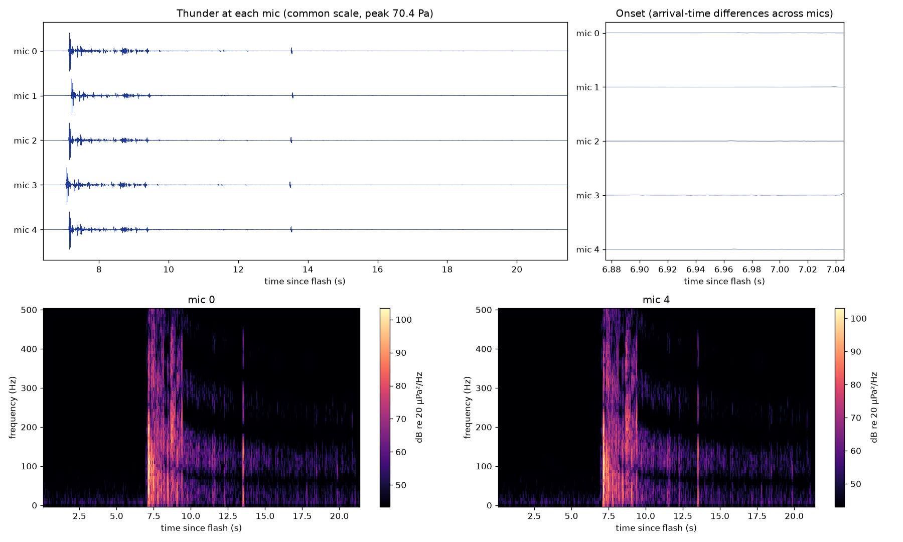
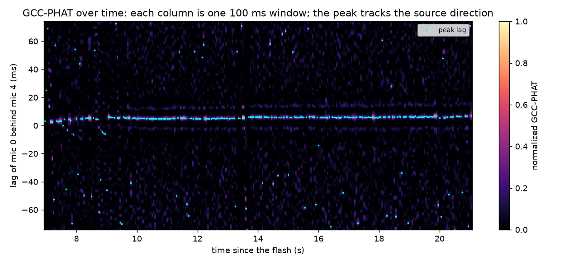
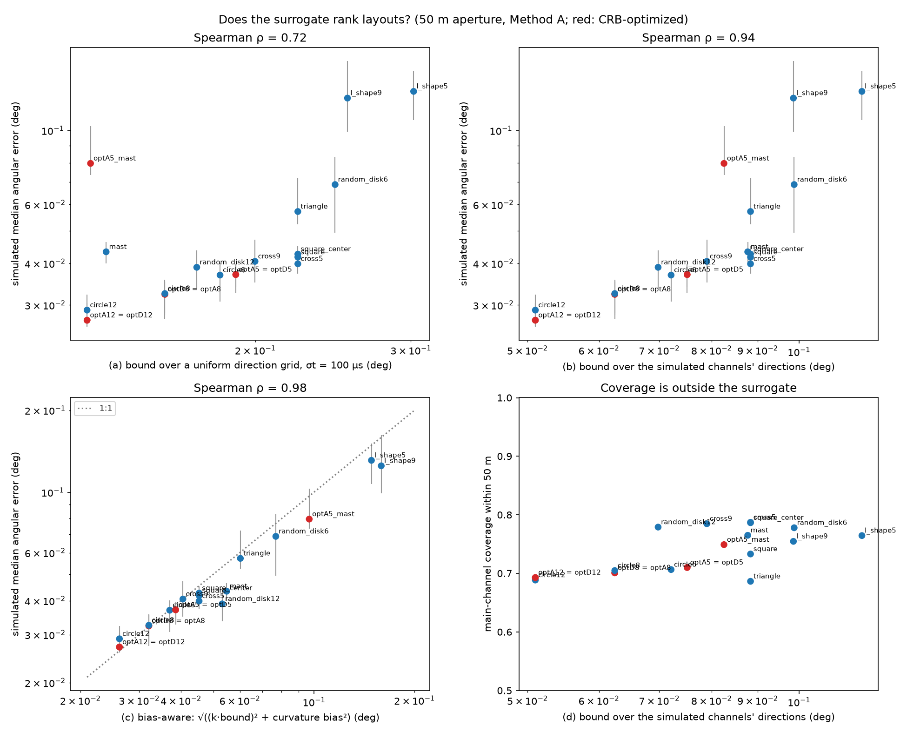
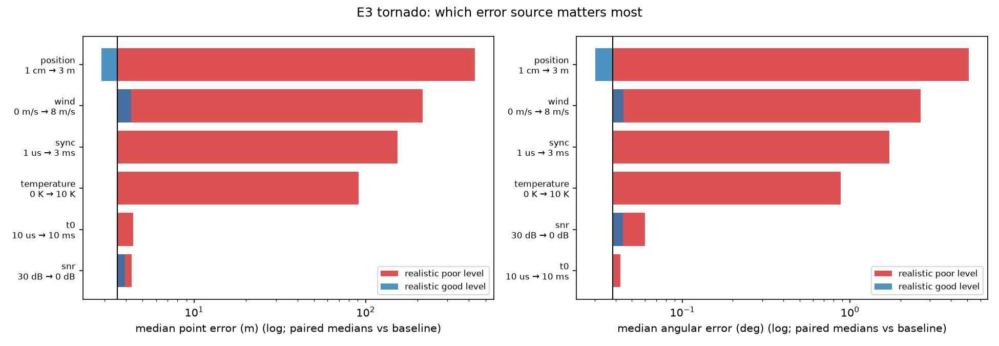
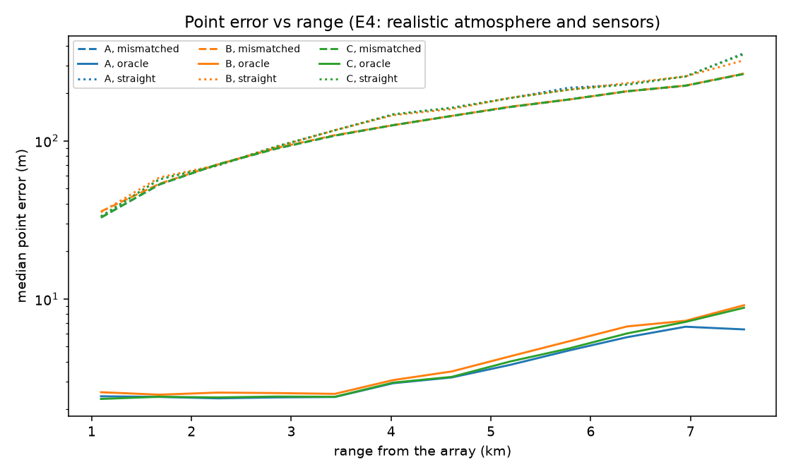

# Reconstructing lightning channels from thunder with microphone arrays: a simulation study

*Technical report: simulation framework, reconstruction methods, and experiments E1–E7.*

## Abstract

Thunder carries the geometry of the lightning channel that produced it. Each piece of channel radiates a pressure pulse when the return stroke heats it, and the pulses reach the microphones of a small array at slightly different times. I built a simulation framework that generates realistic lightning channels, synthesizes the thunder an array would record, and reconstructs the channel in 3D.

**The forward model** propagates the sound through a stratified, windy atmosphere by exact ray tracing, with absorption, ground reflection and realistic sensors.

**Four reconstruction methods:**
- **A:** plane-wave time differences;
- **B:** steered response power, several sources per window;
- **C:** absolute-time multilateration;
- **D:** a Bayesian method with calibrated uncertainty and atmospheric self-calibration.

**Evaluation:** paired Monte Carlo experiments with bootstrap confidence intervals. The reconstruction code never sees the ground truth.

**Results:**
- **Accuracy with the atmosphere known:** a 5-microphone, 50 m array locates channel points to about 3 m at 1–3 km (0.03–0.04° in direction).
- **The dominant real-world error is the unknown wind:** about 26 m per m/s, about 130 m for a 5 m/s wind. This matters about 40× more than the choice of method.
- **Array design:** a cheap surrogate, built from the Cramér–Rao bound evaluated over the channel's directions and corrected for the wavefront-curvature bias of plane-wave methods, ranks 20 array layouts in the same order as full simulation (Spearman ρ = 0.98).
- **Error budget:** clocks within 0.4 ms, mic positions within 12 cm, temperature within 2.5 K and wind within 0.7 m/s keep the median error under 20 m.
- **Four phones:** positions measured to about 10 cm and clocks synced to about 0.1 ms reach professional-kit accuracy.
- **Self-calibration:** Method D recovers the temperature profile and gives near-honest error bars, but not the wind, from a few realistic bolts. I trace that limit to per-microphone systematic errors and model misspecification.

## 1. Introduction

**Thunder ranging and the array idea.** A thunder recording starts with a sharp clap and rumbles on for tens of seconds, because the channel is kilometres long and tortuous: sound from its different parts arrives at different times. With one microphone, the delay since the flash gives only range. With several microphones a few tens of metres apart, the small differences in arrival time also give direction. Range plus direction, window by window through the rumble, traces the channel in 3D.

**Why simulation first.** A field campaign needs to know:
- what array to build,
- how accurately to synchronize and survey it,
- how much the unknown atmosphere will hurt,
- and what a cheap setup could achieve.

These are quantitative design questions. Simulation answers them, because every error source can be switched on alone and the ground truth is known exactly. The risk is an "inverse crime": reconstructing data with the same model that generated it, which makes results look unrealistically good. The framework guards against it:
- synthesis is finer and more physical than any reconstruction assumes (0.5 m emitters with sub-metre tortuosity, ray-traced propagation, absorption, ground reflection, sensor corruption);
- reconstruction code may not read the ground truth (a test enforces this);
- headline numbers come from runs where the assumed atmosphere differs from the true one. Runs that use the true atmosphere are labelled *oracle* and reported as upper bounds.

**Contributions.**
1. An end-to-end, tested simulation framework (more than 200 automated tests) with exact validation of each physical component.
2. Four reconstruction methods behind one interface, including a Bayesian method whose uncertainty is calibrated on controlled cases.
3. A layout surrogate that predicts full-simulation performance from geometry alone, plus the identification of a wavefront-curvature bias of plane-wave methods on asymmetric layouts.
4. Quantitative error budgets, range limits, a consumer-hardware study, and an analysis of what self-calibration can and cannot recover.

## 2. Related work

*The citations below follow the project plan's reading list. Their bibliographic details have not yet been checked against the sources (see SPEC.md, "References to verify").*

- **Thunder acoustics:**
  - Few's work on the thunder spectrum (1969) and on reconstructing channels from thunder (1970) founded acoustic ray-tracing of lightning.
  - Ribner and Roy (1982) modelled thunder from tortuous channels as a "string of pearls" of pulses.
  - Hill (1968) measured the turn-angle statistics of lightning paths. The generator uses his roughly 16° mean turn angle.
- **Array reconstructions:** Arechiga et al. (2011) localized triggered lightning acoustically. Lacroix, Farges and co-workers compared acoustic reconstructions with a lightning mapping array, which is the kind of validation a field pilot should copy.
- **Time-delay estimation and beamforming:** generalized cross-correlation with PHAT weighting (Knapp and Carter 1976), and steered response power (DiBiase 2000).
- **Atmospheric absorption:** ISO 9613-1.
- **Ray acoustics in moving media:** Pierce's *Acoustics*.
- **Inverse-problem framing:** the "inverse crime" and Bayesian inversion follow Kaipio and Somersalo (2005).

This work adds a systematic, fully simulated evaluation of array design, error sources and self-calibration, with honest (mismatched-model) reporting.

## 3. Forward model

### 3.1 Lightning channel

**Main channel:** a 3D random walk of about 10 m segments from a cloud start height (4–7 km) to a strike point 1–8 km from the array. Turn angles are drawn from a half-normal distribution with a 16° mean, steered toward the goal by a von Mises distribution on the turn direction (A4, A5).

**Other elements:**
- branches spawn with probability 0.01 per step, up to depth 2 by default, carrying 20% of the parent's energy per unit length (A7, A8);
- presets add a near-horizontal in-cloud section or several strokes;
- the channel's measured tortuosity statistics are checked against the configuration in tests.

### 3.2 Acoustic source

Each 0.5 m piece of channel radiates an N-wave (A11, A12):
- **Duration:** chosen so its spectral peak matches Few's $f_\text{peak} = 0.63\,c/R_0$:

$$T = \frac{x^*}{\pi f_\text{peak}},\qquad x^* = 2.0816 \text{ (maximum of } T\,|j_1(\omega T/2)|\text{)}.$$

- **Amplitude:** set by energy conservation for a line source, $q = \sqrt{\eta E_\ell \rho_0/\pi}/T$, with an acoustic efficiency $\eta = 0.002$ (a literature estimate, marked VERIFY). This gives about 50 Pa peak at 3 km.
- **Tortuosity below the segment scale:** a Brownian bridge inside each segment (A14).
- **Deposition:** each piece's arrival is deposited continuously on an 8× oversampled time grid and decimated to the 8 kHz recording rate.

### 3.3 Atmosphere and propagation

- **Profiles:** horizontally stratified, with a lapse rate (and optional inversion), constant relative humidity (sound speed uses the sonic temperature), hydrostatic pressure, and a power-law wind with optional veer (A30–A33).
- **Eigenrays:** solved exactly through the conserved horizontal slowness $s_h$. In still air, a source at height $h$ and horizontal offset $X$ is reached by the ray whose $s_h$ solves

$$X(s_h) = \int_0^h \frac{s_h\,c(z)}{\sqrt{1 - s_h^2 c(z)^2}}\,dz,\qquad T(s_h) = \int_0^h \frac{dz}{c(z)\sqrt{1 - s_h^2 c(z)^2}}.$$

  With wind, the conserved quantity and both integrands include the wind's horizontal component (advection of the wavefront and the moving-medium dispersion relation).
  Amplitude (ray-tube spreading with ρc impedance) comes from the same quadratures. Points with no ray to the array fall in the acoustic shadow and are silent.
- **Validation:** the solver matches an independent ODE ray tracer to 0.5 m and 0.1 ms, and the shadow-zone distance matches circular-ray theory to 2%.
- **Absorption and reflection:** ISO 9613-1 absorption is applied per path-length bin, and a single ground reflection (rigid ground) is included.

### 3.4 Sensors

- **Array layouts:** triangle, square, square + center, circle, L, cross, mast, random disk, distributed, or free-form.
- **Microphones:** band-pass responses and tolerances (presets from measurement-grade to phone).
- **Noise:** coherent background noise (diffuse field), wind noise (incoherent beyond a few metres) and rain noise.
- **Timing and positions:** per-mic clock offsets and drift ($\tau = (1+\delta)t + \tau_0$), per-mic position errors, a flash-time error, and ADC quantization.
- **The "realistic field kit"** used from E2 on: measurement mics, GPS-synced clocks (1 µs), surveyed positions (1–2 cm), a photodiode flash trigger (10 µs), 45 dB SPL ambient and 3 m/s wind noise.

*Figure 1. Synthesized thunder at five microphones (common scale), the onset showing the arrival-time differences across the array, and spectrograms. The energy concentrates in the 10–300 Hz band.*

## 4. Reconstruction

All methods share one interface and the same preprocessing:
- **Preprocessing:** band-pass 10–300 Hz, then 100 ms windows with 50% overlap across the rumble.
- **Post-processing:** DBSCAN outlier removal, a minimum-spanning-tree skeleton, and strike-point extrapolation.

**Method A: plane-wave time differences.**
- **Measuring the delays:** for every mic pair, a two-pass β-PHAT generalized cross-correlation ($\beta = 0.6$).
  - First pass: a short window on the reference mic against a long window covering every physical lag.
  - Second pass: matched windows on the same sound at both mics, which reduces the lag noise about 200×.
  - The β-PHAT correlation is normalized so a perfect match peaks at exactly 1 for any $\beta$ (a bug fixed in M6).

*Figure 2. GCC-PHAT between two mics, window by window: the correlation peak traces the arrival direction through the rumble.*

- **Direction:** slowness $\mathbf p$ solves $\min\|W^{1/2}(A\mathbf p + \boldsymbol\tau)\|^2$ subject to $|\mathbf p| = 1/c$, solved exactly with the secular equation. For a planar array, $p_z$ follows from the constraint.
- **Range:** $c\,(t_c - t_0)$ from the window's energy centroid. Through a stratified assumed atmosphere, the point is instead traced back along the bent ray.
- **Gates:** correlation peak, fit residual and slowness consistency.

**Method B: steered response power.** It searches over horizontal slowness, keeps up to three sources per window, re-measures each detected source's delays in a narrow search, and gives each its own beam-steered arrival time. It is the only method that resolves two simultaneous sources (a test checks this).

**Method C: absolute-time multilateration.**
- **Observations:** each mic's absolute travel time $T_m = t_c + d_m - t_0$, built from the pair delays and the reported flash time.
- **Solve:** robust (soft-L1), batched Gauss–Newton through the assumed atmosphere, using the ray solver's free gradient $\partial T/\partial \mathbf x = -\mathbf s_\text{source}$.
- **What it adds:** it models wavefront curvature exactly, so it suits large arrays.

**Method D: Bayesian, with self-calibration.**
- **Likelihood:** per window, $\mathbf t_k \sim \mathcal N(\mathbf T(\mathbf x_k;\theta) + \delta t_{0,g},\, \Sigma_k)$ with

$$\Sigma_k = a_k I + b_k \mathbf 1\mathbf 1^\top,$$

  - $a_k$: per-mic noise (each window's pair misfit, with a 50 µs floor, plus clock and position terms);
  - $b_k$: noise common to the window (the sound's time spread within the window, plus the flash-time error).
- **Self-calibration model:** a moving medium whose path-averaged sound speed and wind are linear in source height,

$$c(h) = c_0 + c_1 h,\qquad \mathbf w(h) = \mathbf w_0 + \mathbf w_1 h,$$

  with closed-form travel time ($|\mathbf d - \mathbf w T| = cT$) and analytic derivatives.
- **Joint unknowns:** the medium, the flash-time offsets, the per-mic clock and position offsets, and every window's position, estimated jointly over one or several bolts ("storm" self-calibration).
- **Inference:**
  - **Variable projection:** given the shared parameters, windows separate into 3-parameter problems, solved vectorized.
  - **Outer solve:** trust region, with the exactly projected Jacobian.
  - **Robustness:** a robust pass, a chi-square gate, then a plain refit, so the final fit uses the Gaussian model the error bars assume.
- **Uncertainty:** Laplace covariances propagate the medium's uncertainty into every point, $H_{xx}^{-1} + H_{xx}^{-1}H_{x\theta}S^{-1}H_{\theta x}H_{xx}^{-1}$. A per-window MCMC (emcee) serves as the reference.

## 5. Evaluation

**Metrics:**
- **Point error:** distance from each reconstructed point to the true channel polyline, computed exactly per segment (median and 90th percentile).
- **Coverage:** the fraction of true channel length within $d$ of a reconstructed point (all, main channel, side branches).
- **Other:** radial and transverse split, angular error (transverse error over range), strike-point error, uncertainty calibration (fraction inside the 1/2/3σ ellipsoids, against the χ²₃ values 0.199 / 0.739 / 0.971) and runtime.

**Experimental design:**
- **Paired comparisons:** variants of an experiment run on *the same bolts* (common random numbers). Stage results are shared through a cache keyed by each stage's inputs.
- **Confidence intervals:** 95% bootstrap over bolts (or over storms, when bolts share an atmosphere).
- **Tuning discipline:** gates were tuned on development seeds that the experiments never use.

## 6. Experiments and results

### E1: sanity

Ideal conditions (still air, no noise, perfect sync, 5 mics, 50 m), Method A, 200 bolts at 1–3 km: median point error **1.4 m** [1.4, 1.5], main-channel coverage within 50 m 83%, every bolt reconstructed.

### E2: array design

51 variants on 30 bolts:
- 13 layouts at 50 m;
- 3 families × 5 apertures (5–500 m) × Methods A and C;
- 7 layouts optimized against the Cramér–Rao bound (A- and D-optimal, by differential evolution);
- 2 distributed arrays.

**The surrogate:**
- **Base quantity:** the Fisher information of a plane wave's direction with independent timing errors, $F = (\sigma_t c)^{-2}\sum_m \mathbf g_m\mathbf g_m^\top$, $\mathbf g_m = D^\top(\mathbf m_m-\bar{\mathbf m})$.
- **Averaged over a uniform direction grid**, it ranks the layouts with ρ = 0.72. A flat array's bound grows as $1/\sin^2(\text{el})$, so the grid overweights horizon directions where little channel actually is.
- **Evaluated over the simulated channels' directions:** ρ = 0.94.
- **Adding the plane-wave curvature bias:** ρ = **0.98**.
  - **The bias:** at 2 km the wavefront curves by up to 0.6 m across 50 m. That enters the plane-wave fit through the layout's third moments, which vanish for symmetric layouts but not for masts, L-shapes or random placements: 0.1–0.3° bias, proportional to 1/R.
  - **Diagnosis:** the fit itself is efficient (within 3% of the bound), and the measured delays are accurate to 3–5 µs, so the bias belongs to the model, not the measurement. Method C, which models curvature, removes it.

*Figure 3. Three surrogates against full simulation for 20 layouts at 50 m.*

**Design results:**
- **Optimal flat layouts are regular polygons**, as the theory predicts.
- **Aperture:** accuracy improves as 1/aperture, but coverage peaks at 15 m (88%) and collapses beyond 50 m. Across long baselines the waveforms of an extended source decorrelate, and the point-source bound cannot see that cost.
- **Recommendation:** square + center at 50 m (0.043°, 79% coverage). A 12-mic ring gives 0.027° at 10 points less coverage.

### E3: error budget

One-at-a-time sweeps of six factors from the realistic baseline, then a pairwise sweep of the two worst.

| Keep the median point error ≤ 20 m | Tolerance |
| --- | --- |
| Clock sync | ≤ 0.43 ms |
| Mic positions | ≤ 12 cm |
| Flash time | ≤ 97 ms |
| Unknown wind | ≤ 0.66 m/s |
| Assumed temperature | ≤ 2.5 K |

- **Ranking at realistic "poor" levels:** phone-GPS positions (no usable points), then unknown wind (61× the baseline error), hand-clap sync (43×), and a 10 K temperature error (26×).
- **Flash time and SNR** barely matter for accuracy, but SNR sets coverage: 50% coverage needs about 23 dB.
- **Error sources don't compound:** the larger one dominates.

### E4: method comparison

Methods A, B and C × {straight rays, a mismatched stratified profile, the true atmosphere}, on 60 bolts across all five presets, with the realistic atmosphere (6.5 K/km, 5 m/s wind) and sensors.

| | Median error | Main / branch coverage (50 m) | CPU per bolt |
| --- | --- | --- | --- |
| True atmosphere: A / B / C | 3.0 / 3.3 / 3.0 m | 80 / **86** / 80% · 47 / **57** / 47% | 2 / 6 / 19 s |
| Wind unknown (any method) | 124–136 m | 2–5% | |

B finds the most channel and branches; C equals A on a compact array at up to 10× the cost.

*Figure 4. Point error against range per method: the atmosphere, not the method, separates the curves.*

### E5: limits

Distance 1–15 km, branching depth 0–3, and in-cloud sections, with Method B and absolute ambient noise.
- **Direction accuracy:** about 0.035° at every distance, so point error grows only from 2.8 m to 13 m.
- **Coverage:** main-channel coverage falls below 50% at about **11 km**. The causes are the refraction shadow (41% of the channel at 15 km) and overlapping arrivals: the channel compresses in time from 1.7 to 0.7 s of recording per km of channel.
- **Not the limit:** noise and absorption. 20 dB more ambient noise moves the limit only from 11.0 to 10.5 km.

### E6: four phones

| Setup | Median error |
| --- | --- |
| 4 phones (phone GPS positions, hand-clap sync, video flash time) | 490 m |
| + 0.1 ms sync | 569 m |
| + tape-measured positions | 264 m |
| **+ tape + sync** | **180 m** (field kit: 165 m) |
| + tape + sync, true atmosphere | **25 m** |

Phone positions are the limit. Once they are measured, phones are as good as professional gear, and what remains is the wind. Method D on the upgraded phones (self-calibrating the atmosphere and the array) reaches 163 m with near-honest error bars (2σ coverage 0.87).

### E7: self-calibration

12 storms of 6 bolts each, each storm with its own true atmosphere; every method assumes the standard atmosphere.

| | Median error | 2σ coverage (nominal 0.74) |
| --- | --- | --- |
| Standard atmosphere | 174 m | 0.00 |
| D, self-calibrating each bolt | 169 m | 0.87 |
| D, 6-bolt storm | 150 m | 0.68 |
| True atmosphere | 3.2 m | 0.92 |

**What self-calibration achieves:**
- **Honest uncertainty:** standard-atmosphere error bars contain almost nothing; self-calibrated ones are near nominal.
- **Temperature profile:** the sound-speed gradient is recovered to about 0.25 m/s per km.

**What it does not:** recover the wind. A controlled study explains why:
- **One bolt sees the wind only along its line of sight.** A cross-wind shifts every apparent source sideways in proportion to its travel time, which looks like a different channel. Storms with bolts at several azimuths fix this in clean conditions (13–24 m vs 80–98 m).
- **What is left of the wind's signal is tiny.** Once the sources absorb a cross-wind's displacement, the remaining signature is microsecond-level, the size of a few millimetres of mic position. A controlled storm recovers the wind with a 1 mm array prior, but not with 2 cm.
- **On realistic recordings, per-mic systematic errors are pooled across windows and absorbed as fake wind.** Even 2 cm of position error (about 60 µs) does this. Modelling them as parameters ("array calibration") makes the error bars honest. But mic offsets and the wind then share the signal, and the likelihood itself prefers a slightly wrong wind (model misspecification).

The practical route to the 3 m oracle is independent wind data used as Method D's prior.

## 7. Limitations

- **Simulation only.** No real thunder has been reconstructed yet.
- **The source model:** N-waves from a linear-acoustics source, with an acoustic efficiency and channel energy taken from the literature (both VERIFY). Real thunder is louder or quieter and nonlinear near the channel.
- **The atmosphere:** horizontally stratified, with no turbulence, no diffraction into the shadow, and a rigid ground.
- **Sensor and noise levels** are datasheet- or literature-based estimates (VERIFY).
- **Methods A–C need all mic pairs to correlate**, which limits large and distributed arrays. Per-subarray processing is not implemented.
- **Method D's self-calibration medium** is straight-ray and height-linear. Its flat-array, self-calibrating posterior has a light 3σ tail (0.91 vs 0.97).

## 8. Future work

1. **A field pilot:** a 5-mic, 50 m square + center array with GPS-disciplined recorders and surveyed positions, a photodiode trigger, and a radiosonde or nearby sounding. Validate against a lightning mapping array or photographs.
2. **Use measured wind** (anemometer plus sounding) as Method D's prior. Self-calibrate over storms with wide azimuth coverage.
3. **A curvature-corrected Method A**, and per-subarray processing for distributed arrays.
4. **The SPEC's stretch goals:** weak-shock source propagation, turbulence, intracloud-only flashes, stroke separation, and a learned reconstructor tested under model mismatch.

## Reproducibility

Every run folder holds its resolved configuration, seed and git commit. Each experiment has a script that runs it and regenerates its tables and figures from the run folder. The full commands are in the README; design decisions, bugs found and their evidence are in `docs/log.md`, and every modelling assumption is in `docs/assumptions.md`.
