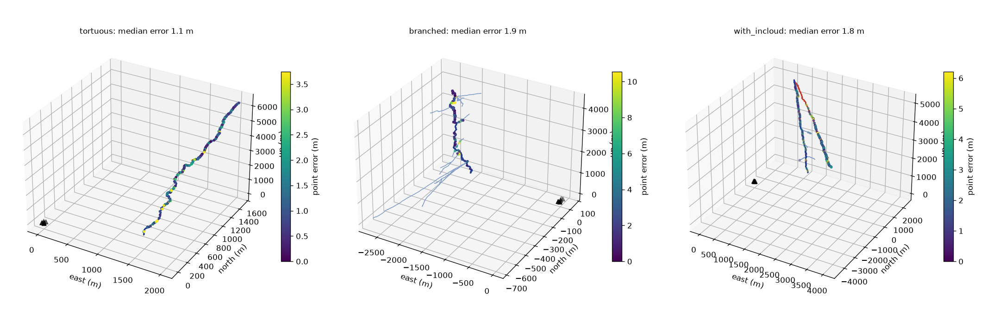
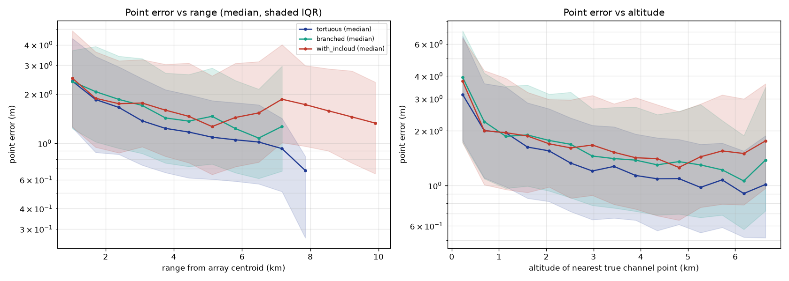
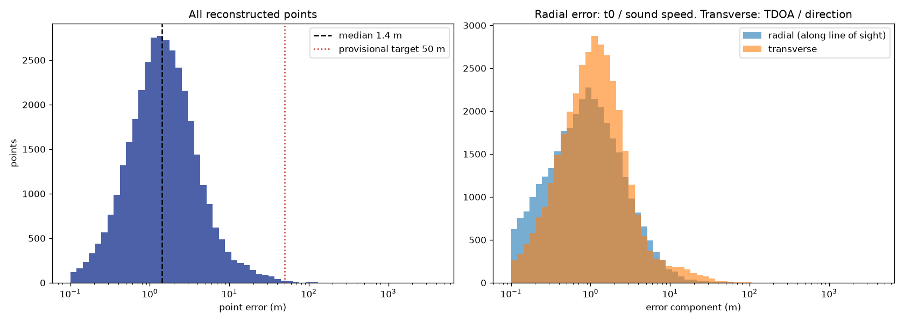
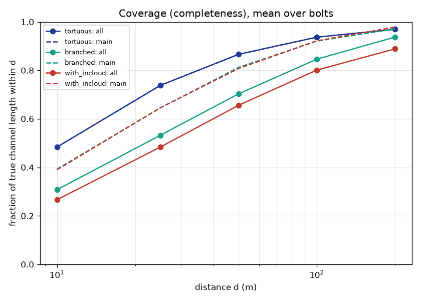
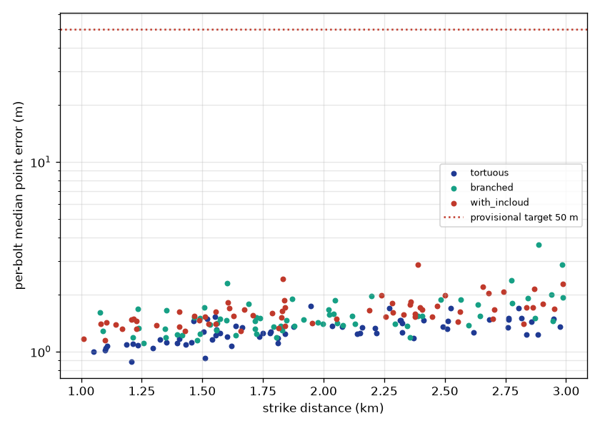

# E1: sanity benchmark (ideal conditions, Method A)

**Question.** Does the pipeline work end to end? Under ideal conditions, does Method A put reconstructed points close to the true channel for bolts 1–3 km away? (M4 gate: median point error under about 50 m.)

**Answer.** Yes, by a wide margin. The median point error is **1.4 m** (95% CI 1.4–1.5 m), about 35× better than the provisional target. Every one of the 200 bolts was reconstructed, and the worst bolt's median error was 3.7 m.

**Setup.**
- **Bolts:** 200, cycling through the `tortuous`, `branched` and `with_incloud` presets, with strikes 1–3 km from the array.
- **Conditions:** still uniform air at 25 °C, no noise, perfect clocks and positions, exact flash time.
- **Array:** 5 mics (square plus center), 50 m aperture.
- **Synthesis:** 0.5 m emitters with sub-meter tortuosity.
- **Method:** Method A with its default gates, tuned only on development seeds 5000+, never on these bolts.
- **This is an oracle run.** Reconstruction assumes the true atmosphere, so these numbers are an *upper bound*. Headline results must come from mismatched-atmosphere runs (M5+).
- **Reproduce:** `python scripts/run_experiment.py configs/experiments/e1_sanity.yaml`, then `python scripts/make_figures.py <run_dir>`.

## Results

Run `e1_sanity`, seed 20261005, config hash `2fbb2e717889`, commit `f828667f90`.

Bolts: 200 (tortuous, branched, with_incloud), reconstructed points: 36518, bolts with no points: 0. Atmosphere assumed by reconstruction: oracle (the synthesis atmosphere).

| Metric (95% bootstrap CI) | all | tortuous | branched | with_incloud |
| --- | --- | --- | --- | --- |
| Pooled point error, median | 1.4 m [1.4, 1.5] | 1.2 m [1.2, 1.3] | 1.5 m [1.4, 1.5] | 1.6 m [1.5, 1.6] |
| Pooled point error, 90th percentile | 5.0 m [4.7, 5.3] | 3.4 m [3.3, 3.5] | 5.9 m [5.3, 6.3] | 6.1 m [5.7, 6.6] |
| Per-bolt median error, median over bolts | 1.4 m [1.4, 1.5] | 1.3 m [1.2, 1.3] | 1.5 m [1.4, 1.5] | 1.6 m [1.5, 1.6] |
| Radial error, median | 0.8 m [0.7, 0.8] | 0.7 m [0.6, 0.8] | 0.8 m [0.7, 0.8] | 0.9 m [0.8, 1.0] |
| Transverse error, median | 1.1 m [1.0, 1.1] | 1.0 m [0.9, 1.0] | 1.1 m [1.1, 1.2] | 1.1 m [1.1, 1.2] |
| Coverage within 50 m (all channel) | 74% [72, 76] | 87% [85, 88] | 70% [68, 73] | 66% [63, 68] |
| Coverage within 50 m (main channel) | 83% [82, 84] | 87% [85, 88] | 81% [80, 83] | 81% [79, 82] |
| Coverage within 100 m (all channel) | 86% [85, 88] | 94% [92, 95] | 85% [82, 87] | 80% [77, 83] |
| Strike-point error, median | 32 m [27, 39] | 25 m [21, 38] | 36 m [25, 48] | 36 m [28, 43] |
| Reconstruction time per bolt, mean | 1.91 s [1.83, 1.99] | 1.69 s [1.59, 1.79] | 1.62 s [1.53, 1.71] | 2.44 s [2.31, 2.57] |

Also measured:
- **End-to-end time:** 3.8 s per bolt (median), 8.6 s at worst (spec target: under 10 s).
- **Strike-point error:** 90th percentile 125 m.

## What the figures show

The reconstructed points sit on the true main channel to within a few meters. Most branches are **not** reconstructed. Method A finds one direction per window, and a branch's sound overlaps in time with the main channel's.

Error is largest **near the ground** (median 3–5 m below about 500 m altitude, against 1–2 m above). For an array 1–3 km away, the lower kilometer of a near-vertical channel sits at almost one range. Sound from many elevations therefore arrives in the same window, and no single plane wave fits it. Error falls slightly with range: farther sound arrives more spread out in time, so each window holds fewer competing sources.

Radial error (median 0.8 m) is smaller than transverse error (1.1 m). With the exact flash time and sound speed, range is nearly free of error. The remaining direction error comes from mixing several sources within a window, not from measurement noise.

## Limitations and what they mean for the next steps

1. **Oracle atmosphere.** The reconstruction knows the exact sound speed. A 1% speed error alone shifts every range by 1%, which is 20–60 m at 2–6 km. **M5** adds a realistic atmosphere and mismatched reconstruction; the headline numbers will come from there.
2. **Branches and the lower channel.** Method A can't handle several directions at once. **Method B (M6)** takes multiple maxima per window. These two gaps are where E4 should show its improvement.
3. **Noise.** On development bolts, coverage falls from 83% to 60% to 27% at no noise / 25 dB / 15 dB SNR, while accuracy falls only from 1.4 to about 3 m median. SNR is defined by average power, which the claps dominate, so the quiet rumble drops below the noise first. **E3** should also report a per-window SNR.
4. **Uncertainty calibration.** Method A's covariances are conservative: 86% of errors fall inside 1σ, against 20% expected. Its range term uses the spread of energy within a window, about ±10 m, while actual range errors are about 0.8 m. Calibrated uncertainty is the job of **Method D (M8)**.
5. **Multiple strokes are excluded.** A later stroke repeats the rumble 20–100 ms later, which Method A reads as farther points (7–34 m per stroke of delay). Stroke separation is a stretch goal; the multi-stroke preset belongs in E5.
