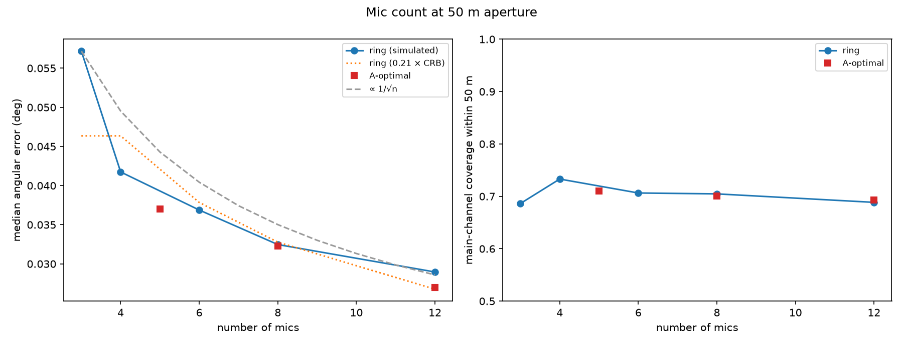
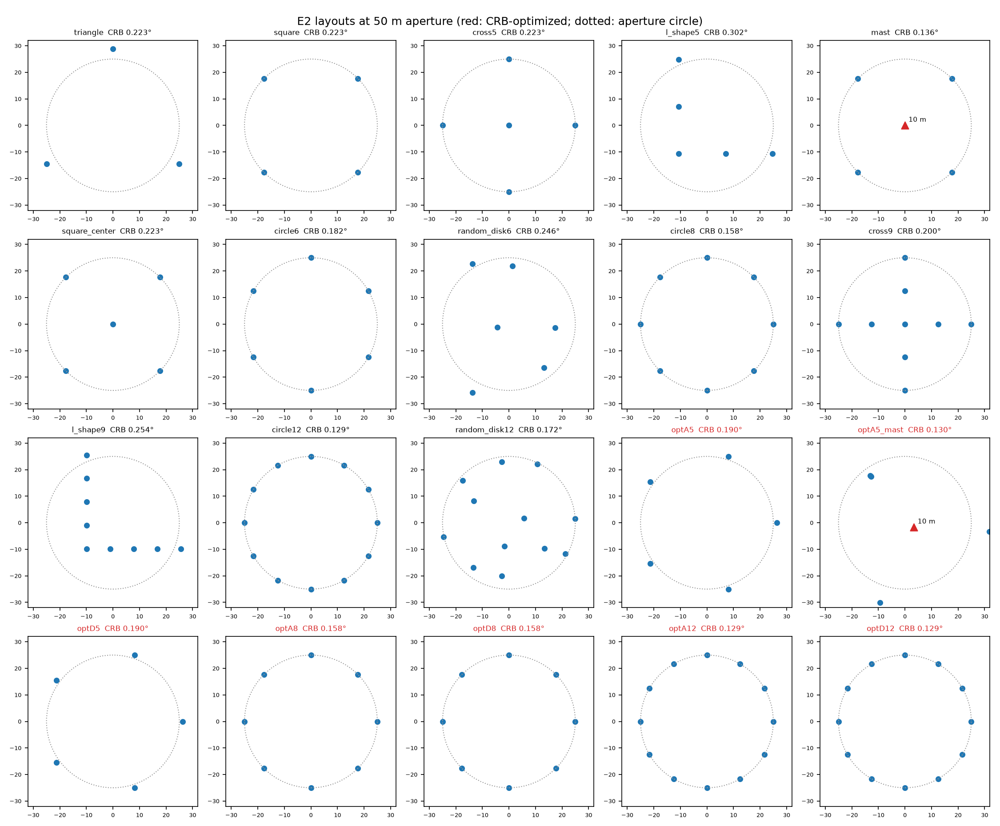
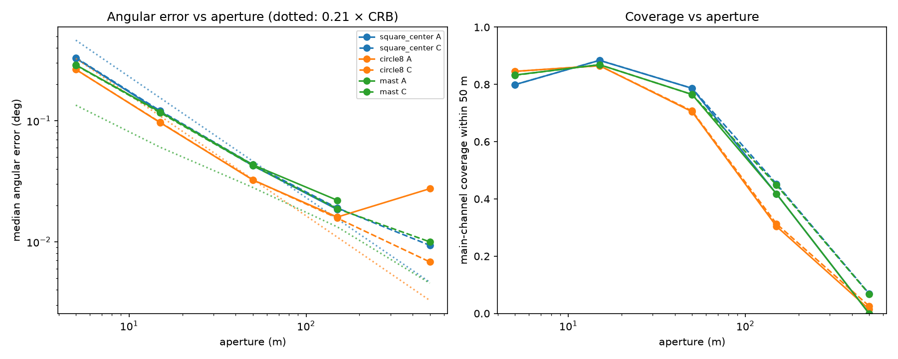

# E2: Array design

**Question.** For a fixed number of mics and a maximum aperture, which layout gives the most accurate reconstruction? Can a cheap theoretical model pick the layout without running full simulations?

**Answer.**
- **The model can pick the layout.** A surrogate built from geometry alone predicts the simulated ranking of 20 layouts with Spearman ρ = 0.98.
- **What it needs** (the textbook Cramér–Rao bound on its own scores 0.72):
  1. weighting by the directions the lightning channel actually occupies;
  2. the wavefront-curvature bias that plane-wave methods suffer on asymmetric layouts.
- **Best layouts:** symmetric ones (rings, square + center, cross) at about 50 m.
- **Coverage, not accuracy, limits larger apertures.**

## Setup

| | |
| --- | --- |
| Bolts | 30 at 1–3 km (tortuous, branched, in-cloud; 10 each), the same 30 in every variant (paired comparisons) |
| Atmosphere | Still, uniform air, known to the reconstruction. This isolates geometry; the atmosphere is E3/E4's subject |
| Sensors | Realistic field kit: measurement mics, GPS-synced clocks, surveyed positions, photodiode t0, 45 dB SPL ambient, 3 m/s wind noise |
| Variants | 51: 13 parametric layouts at 50 m; 3 families × 5 apertures (5–500 m) × Methods A and C; 7 bound-optimized layouts; 2 distributed arrays |
| Main metric | Angular error (transverse error over range, as seen from the array), which is what geometry controls. Per-bolt median, then the median over bolts with 95% bootstrap CIs. Paired ratio = the per-bolt ratio to square + center |
| Provenance | Main run `results/e2_array_design/20261006T175752_002185e3cca7_s20261002` (commit `a31e59c`). Separation check `results/e2_array_design_minsep/20261006T214100_0dab31df0a7e_s20261002` (commit `739c52d`). Analysis: `scripts/e2_array_design.py --analyze`, `thunder.experiments.design` |

## 1. A surrogate that ranks layouts

**Three versions of the surrogate.** Each is scored by Spearman rank correlation with the simulated angular error, over the 20 layouts at 50 m (Method A).

| Surrogate | ρ | p |
| --- | --- | --- |
| (a) Cramér–Rao bound averaged over a uniform direction grid (azimuth every 10°, elevation 5–70°) | 0.72 | 3×10⁻⁴ |
| (b) The bound over the directions of the simulated channels | 0.94 | 2×10⁻⁹ |
| **(c) (b) plus the plane-wave curvature bias: √((k·bound)² + bias²)** | **0.98** | **2×10⁻¹³** |

**The bound.**
- **Model:** the Fisher information of a plane wave's direction with independent mic timing errors, with the unknown emission time removed.
- **Checks:** it matches finite differences, reduces to the closed form for symmetric arrays, and scales as σt/aperture (all tested).
- **Consequence:** the best planar shape doesn't depend on aperture.

**Why (b) beats (a).**
- **The grid problem:** a planar array's bound grows as 1/sin²(elevation), so a uniform grid is dominated by near-horizon directions, exactly where a 10 m mast helps most.
- **Real channel points** at 1–3 km mostly sit higher. The surrogate regenerates the exact channels of the run (same seeds) and evaluates the bound at every channel point.
- **What (a) gets wrong:** it says the mast is 39% better than square + center. (b) says equal, and the simulation agrees (paired ratio 1.11 [0.99, 1.18]).

**Why (c) beats (b): a finding about the methods, not the bound.**
- **The bias:** Methods A and B fit a plane wave. At 2 km, the wavefront across a 50 m array departs from a plane by up to about 0.6 m. That curvature term is quadratic in mic position, so it biases the fitted direction through the layout's **third moments**.
- **Which layouts escape it:**
  - centrally symmetric layouts (square + center, cross);
  - regular polygons, except the triangle (Σcos³ of equally spaced angles is zero unless n is a multiple of 3).
- **Which layouts pay** (bias of order aperture²/R): a raised mast mic, L-shapes, random or irregular placements, the triangle.
- **How it was found, step by step:**
  - The direction fit is efficient: with ideal per-mic noise it reaches the bound within 3% on every layout.
  - Measured time differences are 3–5 µs accurate for every layout.
  - Yet point sources showed 0.10–0.30° errors on asymmetric layouts.
  - Exact noise-free spherical waves reproduce those errors as pure bias: mast 0.11°, triangle 0.19°, random 0.18°, L-shape 0.29° at 2 km, all ∝ 1/R. Symmetric layouts give 0.003°, ∝ 1/R².
  - **Method C** fits absolute times with curvature and removes most of it. Point-source errors fall to 0.035–0.042° for the masts (square + center: 0.037°), and to 0.079° for the L-shape (was 0.30°).
- **The surrogate** adds this bias, computed exactly from geometry (`plane_wave_bias`), in quadrature to the bound's spread.
- **Calibration:** one constant k = 0.51, fit on the 13 bias-free layouts, which means an effective timing noise of about 51 µs (0.4 samples at 8 kHz).

## 2. Layout ranking at 50 m (Method A)

| Layout | Mics | Curvature bias | Predicted | **Simulated** | Paired ratio | Main coverage |
| --- | --- | --- | --- | --- | --- | --- |
| Circle (12) / A- and D-optimal 12 | 12 | 0.001° | 0.026° | **0.027–0.029°** | 0.65–0.69 | 69% |
| Circle (8) / optimal 8 | 8 | 0.001° | 0.032° | **0.032°** | 0.78 | 70% |
| Pentagon (= optimal 5) | 5 | 0.001° | 0.039° | **0.037°** | 0.85 [0.77, 1.04] | 71% |
| Circle (6) | 6 | 0.001° | 0.037° | **0.037°** | 0.87 [0.75, 0.98] | 71% |
| Cross (9) | 9 | 0.001° | 0.041° | **0.041°** | 0.93 | 78% |
| Cross (5) | 5 | 0.001° | 0.045° | **0.040°** | 0.96 | 79% |
| Square (4) | 4 | 0.001° | 0.045° | **0.042°** | 1.00 | 73% |
| **Square + center (5)** | 5 | 0.001° | 0.045° | **0.043°** | 1 | **79%** |
| Mast (square + 10 m center) | 5 | 0.032° | 0.055° | **0.043°** | 1.11 [0.99, 1.18] | 76% |
| Random in disk (12) | 12 | 0.036° | 0.053° | **0.039°** | 0.91 | 78% |
| Triangle (3) | 3 | 0.037° | 0.060° | **0.057°** | 1.59 [1.28, 1.81] | 69% |
| Random in disk (6) | 6 | 0.054° | 0.077° | **0.069°** | 1.68 [1.32, 1.93] | 78% |
| L-shape (9) | 9 | 0.151° | 0.159° | **0.125°** | 3.43 | 75% |
| L-shape (5) | 5 | 0.137° | 0.149° | **0.131°** | 3.37 [2.63, 3.65] | 76% |

- **Accuracy:** it improves roughly as 1/√n with mic count on symmetric rings, as the bound predicts (figure below).
- **Coverage moves the other way:**
  - **Values:** rings without a center mic recover 69–71% of the main channel; layouts with a center or short baselines (square + center, crosses) recover 78–79%.
  - **Mechanism:** a window passes Method A's gates only when every pair correlates, and short baselines keep pairs coherent when several channel parts overlap.
  - **The tradeoff at 5 mics:** the pentagon is 15% more accurate; square + center recovers 8 points more of the channel.

## 3. Optimized layouts

**Search.** Differential evolution over free mic positions, A-optimal (minimize the trace of the inverse Fisher information) and D-optimal (maximize its log-determinant), under the aperture constraint.
- **Starting population:** seeded with regular polygons.
- **Guarantee:** the result is never worse than them.

**Planar result: regular polygons.** For n = 5, 8 and 12, both criteria return the regular polygon (equal to the circle to 4 digits).
- **Why:** this is the theoretical answer. For a planar array the Fisher information depends only on the horizontal second-moment matrix, which is largest and isotropic with all mics on the rim at balanced angles.
- **Simulation:** the optima perform exactly like the equivalent circles.

**Mast: two lessons about the surrogate's assumptions.**
1. **Independent noise rewards stacking.**
   - **What happened:** the unconstrained optimizer put two mics 0.45 m apart (grid bound 0.130°, the best 5-mic score). It was 2× worse in simulation.
   - **Why:** mics that close hear the same waveform and noise, so their errors are correlated, not independent.
   - **Fix:** optimized layouts now keep every pair at least 0.2 × aperture apart.
2. **Separating the mics was not enough.**
   - **Result:** the constrained optimum (all pairs at least 11.5 m apart) was still 1.72× worse than square + center (0.076°; follow-up run, same 30 bolts).
   - **Why:** both mast optima are asymmetric, so the curvature bias (0.09° predicted) dominates. The bias-aware surrogate predicts this; the plain bound cannot.
   - **With Method C:** the optimized mast is marginally the best 5-mic layout for point sources (0.035° vs square + center 0.037°), as the bound promised.
   - **Check:** the follow-up run reproduced the main run's results for square + center, mast and pentagon to every printed digit (common random numbers across separate runs).

## 4. Aperture: accuracy vs coverage

Square + center, Method A; Method C in brackets where it differs.

| Aperture | Angular error | Point error | Main coverage | Windows passing |
| --- | --- | --- | --- | --- |
| 5 m | 0.33° | 24 m | 80% | 99% |
| **15 m** | 0.12° | 9.1 m | **88%** | 93% |
| **50 m** | 0.043° | 3.4 m | 79% | 61% |
| 150 m | 0.018° | 1.8 m | 42% (C 45%) | 24% |
| 500 m | nothing placed (C 0.009°) | — (C 1.2 m) | 0% (C 7%) | 0% (C 4%) |

- **Accuracy:** angular error falls as 1/aperture, as the bound predicts, all the way to 150 m.
- **Coverage:** it peaks at 15 m and collapses beyond 50 m. The point-source surrogate can't see this cost.
  - **Cause:** each analysis window holds sound from an extended stretch of channel, and the inter-mic delay changes along that stretch at a rate proportional to aperture/(c·R). Across long baselines the waveforms stop matching.
  - **Diagnosed before the run:** at 150 m, only 36 of 166 windows had times that any channel point could explain. At 500 m, 4 of 180.
- **Method A at 500 m:** it also hits curvature (about 15 m of path difference at 2 km) and places nothing.
- **Method C at 500 m:** it models curvature, so its few surviving windows are very accurate (1.2 m), but they cover only 7% of the channel.
- **Distributed arrays** (three 20 m triangles 300 m or 1000 m apart, processed as one array): coverage under 10%.
  - **Why:** cross-subarray pairs decorrelate exactly as above.
  - **What they need:** per-subarray processing, with directions measured within each compact subarray and then triangulated. This is future work.

## Recommendation

| Goal | Layout |
| --- | --- |
| **Best all-round, 5 mics** | **Square + center at 50 m**: 0.043° (about 3 m at 1–3 km) with the best 5-mic coverage (79%) |
| Most accurate directions | A ring with as many mics as possible at 50 m (12 mics: 0.027°), giving up about 10 points of coverage |
| Most of the channel | 15 m aperture (88% coverage) at about 3× the angular error |
| Avoid with plane-wave methods (A, B) | Asymmetric layouts: L-shapes, triangles, random placement, raised single mics. They carry a curvature bias of order aperture²/R. Use Method C for them |
| Avoid with window-correlation methods | Apertures beyond about 50 m for bolts within a few km: waveform decorrelation removes most of the channel |
| Choosing layouts without simulating | The bound over the expected source directions, plus the plane-wave curvature bias (if A or B will be used), with a minimum mic spacing; check coverage separately |

## Limitations

- **Still air:** E3 adds atmospheric errors.
- **Distance:** bolts at 1–3 km only; E5 covers distance, and the curvature bias shrinks as 1/R.
- **Coverage:** its dependence on layout is a property of Methods A–C, which require all pairs to correlate. Pair-selecting or per-subarray methods could change that side of the tradeoff.
- **Calibration:** the surrogate's calibration (k) is fit on this run's bias-free layouts. Its ranking power was measured on the same 20 layouts; a held-out set of layouts would be the stronger test.
