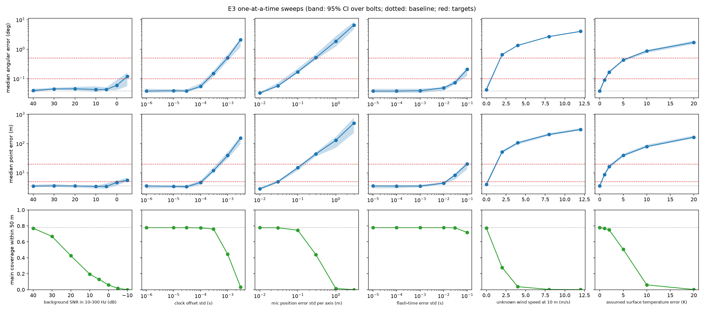
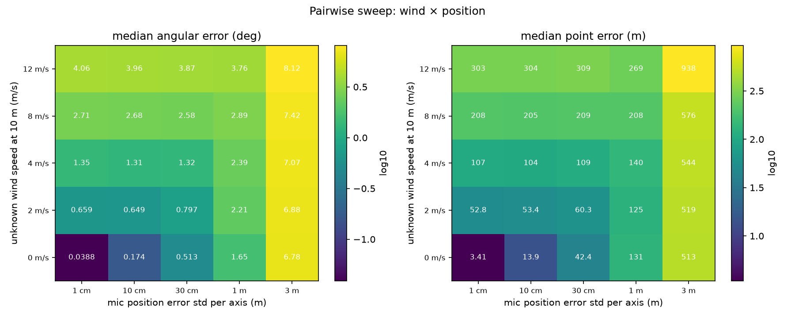

# E3: Robustness and error budget

**Question.** Which real-world error sources matter, and how good must each be? For example: to keep the angular error under X°, how well must the clocks be synced and the mic positions be known?

## Setup

| | |
| --- | --- |
| Baseline | E2's realistic field kit: 5 mics (square + center), 50 m, still uniform air known to the reconstruction, Method A. Median angular error 0.038°, point error 3.6 m, main coverage 78% |
| Bolts | 30 at 1–3 km (tortuous, branched, in-cloud), the same 30 in every variant (paired comparisons) |
| Phase 1 | One factor at a time, 38 levels + baseline |
| Phase 2 | The two factors that hurt most at their realistic poor levels, jointly (5 × 5) |
| Provenance | `results/e3_error_budget/20261006T184830_fd5184126f2d_s20261003` and `results/e3_error_budget_pair/20261006T191804_4d6e8ae7c856_s20261003`, commit `a31e59c`, script `scripts/e3_error_budget.py` |

Factors and the levels tested:

| Factor | What is varied | Levels | Realistic good → poor |
| --- | --- | --- | --- |
| SNR | Relative band SNR (10–300 Hz) over the thunder | 40 … −10 dB | 30 → 0 dB |
| Clock sync | Independent per-mic clock offsets (std) | 1 µs … 3 ms | GPS 1 µs → hand clap 3 ms |
| Mic positions | Position error std per axis | 1 cm … 3 m | survey 1 cm → phone GPS 3 m |
| Flash time t0 | Error of the reported flash time (std) | 10 µs … 100 ms | photodiode 10 µs → video ~10 ms |
| Unknown wind | True power-law wind (at 10 m) that the reconstruction ignores | 0 … 12 m/s | 0 → 8 m/s |
| Temperature | Error of the assumed surface temperature | 0 … 20 K | 0 → 10 K |

## Error budget

Largest tolerable level of each factor, all others at baseline. Levels are interpolated between tested points (log-linear for log-spaced factors). A level where no bolt produced points counts as failing.

| To keep… | Clock sync | Mic positions | t0 | Unknown wind | Temperature error | SNR |
| --- | --- | --- | --- | --- | --- | --- |
| median angular error ≤ 0.1° | ≤ 170 µs | ≤ 4.7 cm | ≤ 38 ms | ≤ 0.19 m/s | ≤ 1.1 K | ≥ −3.3 dB |
| median angular error ≤ 0.5° | ≤ 950 µs | ≤ 28 cm | any (to 100 ms) | ≤ 1.5 m/s | ≤ 5.8 K | ≥ −5 dB |
| median point error ≤ 5 m | ≤ 100 µs | ≤ 3 cm | ≤ 12 ms | ≈ 0 (see note) | ≤ 0.28 K | ≥ −1.6 dB |
| median point error ≤ 20 m | ≤ 430 µs | ≤ 12 cm | ≤ 97 ms | ≤ 0.66 m/s | ≤ 2.5 K | ≥ −5 dB |
| main coverage ≥ 50% | ≤ 810 µs | ≤ 24 cm | any (to 100 ms) | ≤ 1.1 m/s | ≤ 5.1 K | **≥ 23 dB** |

**In words**, for a 5-mic, 50 m array at 1–3 km:
- **Within 5 m:** clocks synced to about 0.1 ms, mic positions known to about 3 cm, and a temperature known to about 0.3 K. In practice the wind must also be measured or estimated, since even 1 m/s unknown costs about 26 m.
- **Within 20 m:** sync about 0.4 ms, positions about 12 cm, wind known to about 0.7 m/s, temperature about 2.5 K.
- **Half the main channel recovered:** at least 23 dB band SNR, the only requirement where SNR binds.

*Wind note:* the wind sweep runs in a stratified atmosphere (needed for wind) with no lapse rate. Its zero-wind level is 4.0 m, not the baseline's 3.6 m, because constant relative humidity makes the sound speed rise slightly with height. That puts the 5 m target only 1 m away from zero wind, so the interpolated tolerance is near zero. The useful figure is the slope: about 26 m of point error per m/s of unknown wind.

## Which error source matters most

Paired ratio of the median point error to the baseline, moving each factor from its realistic good level to its realistic poor level:

| Factor | Poor level | Point error × | Angular error × |
| --- | --- | --- | --- |
| Mic positions | 3 m (phone GPS) | 122 [53, 191] (only 2 of 30 bolts keep any point) | 133 |
| Unknown wind | 8 m/s | 61 [51, 69] | 69 |
| Clock sync | 3 ms (hand clap) | 43 [21, 60] | 45 |
| Temperature | 10 K | 26 [18, 28] | 23 |
| Flash time | 10 ms (video) | 1.24 [1.07, 1.36] | 1.11 |
| SNR | 0 dB | 1.22 [0.92, 1.77] | 1.56 |

- **The four that matter:** geometry and timing (positions, sync) and the atmosphere (wind, temperature). Each is worth one to two orders of magnitude between good and poor hardware or knowledge.
- **Flash time:** barely matters below about 10 ms. A t0 error shifts every range by c·Δt0 (3.4 m per 10 ms) but leaves directions unchanged.
- **SNR:** it doesn't degrade the points that survive; it removes them (figure below). Coverage falls from 77% at 40 dB to 43% at 20 dB and 13% at 5 dB, while the median error of the survivors stays near 3.5 m down to 5 dB. Methods A–C reject the windows they can't fit rather than fitting them badly.

## How each factor acts

- **Mic positions and clock sync** corrupt the time differences directly, so the error grows in proportion: about 15 m of point error per 10 cm of position error, and about 40 m per ms of sync error. Large errors also break the plane-wave fit, so coverage collapses at about 30 cm or 1 ms.
- **Unknown wind** bends and advects the sound. About 0.33° of angular error and 26 m of point error per m/s at 10 m height, nearly linear. This matches M5 (5 m/s unknown gave 137 m).
- **Temperature error** changes the assumed sound speed by about 0.17% per K. That scales every range, and it also tilts the estimated elevation, because the fit constrains the slowness magnitude to 1/c. Result: about 8 m and 0.09° per K.

## Pairwise: mic positions × unknown wind

- **Selection:** the two factors that hurt most at their realistic poor levels.
- **They don't compound:** the larger one dominates. Along each wind row the error stays flat until the position error's own effect overtakes it (about 30 cm at 2 m/s, about 1 m at 8 m/s).
- **Why:** the two act on different scales. Wind is a bias common to the whole array; position errors are random per mic.
- **Implication:** improving the smaller error source buys nothing until the larger one is fixed.

## Bottom line

**What the hardware needs to achieve:**
- GPS-disciplined or shared-clock recorders: 0.1 ms or better.
- Surveyed mic positions: a few cm.
- A flash detector of any kind better than about 10 ms (a photodiode is overkill but cheap).
- Enough SNR (about 25 dB in band) for coverage.

**What remains:** the dominant error is the atmosphere. Even modest unknown wind (1 m/s) costs tens of meters, so a deployed system needs wind and temperature profiles, measured (anemometer, radiosonde) or estimated from the thunder itself (Method D and E7 self-calibration, next milestone).

## Limitations

- **One array and distance range:** larger arrays tolerate absolute position and sync errors better in angle; E2's scaling suggests about 1/aperture.
- **Uncorrelated clock offsets:** a common clock offset would cancel in time differences.
- **Wind direction:** unknown wind is one direction (from the west) with the standard power-law profile; gusts and turbulence are not modeled.
