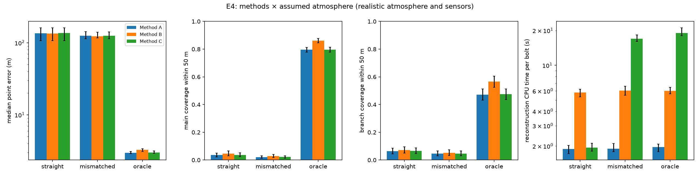
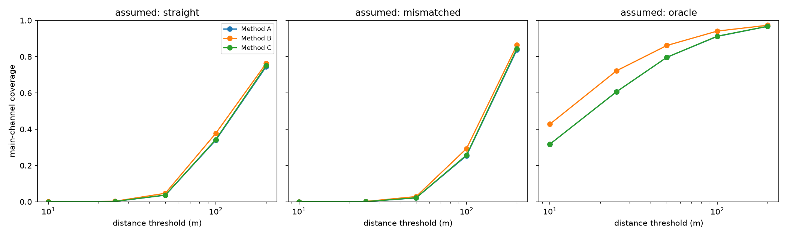
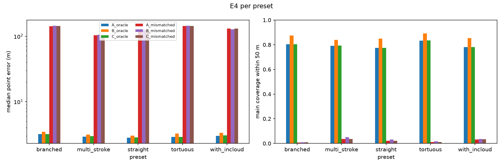

# E4: Method comparison

**Question.** How do the reconstruction methods compare in accuracy, coverage, branch recovery and runtime? Each is tested with straight-line and refraction-aware variants, across all channel presets, with realistic corruption.

## Setup

| | |
| --- | --- |
| Bolts | 60 at 1–3 km: 12 each of straight, tortuous, branched, in-cloud and multi-stroke. All nine variants reconstruct the **same recordings** (one synthesis and one corruption per bolt) |
| True atmosphere | 6.5 K/km lapse, 5 m/s west wind at 10 m (power law), ISO absorption, ground reflection (as in M5/M6) |
| Sensors | Realistic field kit (measurement mics, GPS-synced clocks, surveyed positions, photodiode t0, 45 dB SPL ambient, 3 m/s wind noise); 5 mics, square + center, 50 m |
| Methods | A: plane-wave TDOA. B: SRP-PHAT, several sources per window. C: multilateration. D joins in M8 |
| Assumed atmosphere | **straight**: uniform air at the right surface temperature (straight rays). **mismatched**: right surface temperature, 5 K/km, no wind (refraction-aware, realistic knowledge). **oracle**: the true atmosphere (upper bound) |
| Provenance | `results/e4_methods/20261006T201325_5b30975a4bfd_s20261004`, commit `a31e59c`, script `scripts/e4_methods.py` |

## Results

| Method | Assumed | Median error | vs A oracle (paired) | p90 | Angular | Coverage 50 m (all / main / branch) | Strike | Points per bolt | CPU per bolt |
| --- | --- | --- | --- | --- | --- | --- | --- | --- | --- |
| A | oracle | **3.0 m** [2.9, 3.1] | 1 | 7.6 m | 0.034° | 70% / 80% / 47% | 51 m | 141 | 2.0 s |
| **B** | oracle | 3.3 m [3.1, 3.4] | 1.09 [1.07, 1.11] | 8.8 m | 0.038° | **77% / 86% / 57%** | 49 m | 197 | 6.0 s |
| C | oracle | 3.0 m [2.9, 3.2] | 1.01 [1.01, 1.01] | 8.3 m | 0.035° | 70% / 80% / 47% | 52 m | 144 | 19.0 s |
| A | mismatched | 125 m [114, 142] | 40 [38, 45] | 178 m | 1.64° | 3% / 2% / 5% | 97 m | 140 | 1.9 s |
| B | mismatched | 124 m [117, 140] | 41 [38, 45] | 180 m | 1.64° | 3% / 3% / 5% | 103 m | 196 | 6.1 s |
| C | mismatched | 125 m [114, 141] | 40 [38, 45] | 180 m | 1.64° | 3% / 2% / 5% | 98 m | 143 | 17.0 s |
| A | straight | 136 m [107, 162] | 47 [37, 56] | 202 m | 1.81° | 4% / 4% / 6% | 93 m | 141 | 1.9 s |
| B | straight | 135 m [108, 161] | 48 [39, 56] | 197 m | 1.82° | 5% / 5% / 7% | 94 m | 197 | 5.8 s |
| C | straight | 136 m [107, 162] | 46 [36, 57] | 203 m | 1.81° | 4% / 4% / 7% | 95 m | 144 | 1.9 s |

Brackets: 95% bootstrap CIs over bolts. CPU time is process CPU per bolt, which is comparable across machine load.

**Findings.**

1. **The assumed atmosphere matters about 40× more than the method.** With the true atmosphere every method lands at 3.0–3.3 m. Without the wind, every method lands at 124–136 m, and the methods differ by less than their confidence intervals. A better method cannot repair a wrong atmosphere; this is E3's top finding seen from the method side.

2. **B recovers the most channel.** It finds several sources per window, so it recovers windows where branches and the main channel overlap.
   - **Coverage gain over A:** all-channel coverage within 50 m rises from 70% to 77%, main channel from 80% to 86%, and side branches from 47% to 57%. The gains hold on every preset (table below) and at every distance threshold (figure below).
   - **Cost:** 9% more median error (paired ratio 1.09 [1.07, 1.11]) and 3× the CPU time.
   - **Why the extra error:** its secondary detections are weaker than the dominant arrival A keeps.

3. **C equals A on a compact array, at up to 10× the cost.**
   - **Accuracy:** the paired ratio is 1.01 [1.01, 1.01].
   - **Cost:** with a stratified assumed atmosphere, C traces eigenrays for every mic on every iteration (19 s vs 2 s CPU per bolt). With straight rays it costs the same as A.
   - **Where C earns its cost:** large or distributed arrays, where it models wavefront curvature (E2: 500 m aperture, 1.2 m median vs A placing nothing).

4. **Refraction-aware reconstruction with a partly wrong profile helps a little.**
   - **Median error:** the mismatched assumption cuts it from about 135 m to about 125 m (8%). That comes from the lapse rate it gets roughly right, not the wind it doesn't know.
   - **Coverage within 200 m:** 84% vs 75% for straight rays, so the gain shows at coarser thresholds.
   - **Per preset:** the effect is mixed. It helps tall tortuous and branched channels (143 m vs 171–178 m) and slightly hurts the `straight` preset (124 m vs 111 m).

5. **Presets.** With the true atmosphere, accuracy is nearly the same on every preset (2.8–3.5 m median).
   - **Coverage within 50 m:** 77–84% for A, 84–89% for B.
   - **In-cloud bolts:** they are long (up to about 15 km) and partly far, but their coverage is no worse than the others'.
   - **Multi-stroke bolts:** they reuse the same channel, so later strokes add redundant arrivals rather than new geometry.

6. **Strike point.** Even with the true atmosphere, the strike point is about 50 m off (horizontal). It is extrapolated from the lowest reconstructed section. The likely reason it is off (not separately diagnosed): the bottom few hundred meters arrive at grazing elevation, where time differences carry the least elevation information and ground-reflected arrivals overlap the direct ones.

| Preset | Median error, A / B / C (oracle) | Main coverage, A / B / C (oracle) | Median error, A (mismatched / straight) |
| --- | --- | --- | --- |
| straight | 2.8 / 3.0 / 2.9 m | 77 / 85 / 77% | 124 / 111 m |
| tortuous | 2.9 / 3.3 / 2.9 m | 83 / 89 / 84% | 144 / 178 m |
| branched | 3.2 / 3.5 / 3.2 m | 80 / 87 / 80% | 143 / 171 m |
| with in-cloud | 3.0 / 3.4 / 3.1 m | 78 / 85 / 78% | 132 / 129 m |
| multi-stroke | 2.9 / 3.1 / 3.0 m | 79 / 84 / 79% | 103 / 107 m |

*Coverage within a distance threshold. Method A's curve is hidden under C's (identical).*

## Recommendation

| Use | When |
| --- | --- |
| **B** | Default for compact arrays: most of the channel and branches, 3.3 m median, 6 s per bolt |
| A | Fastest; best accuracy per point; fine when only the dominant channel matters |
| C | Large or distributed arrays (curvature); otherwise no gain for 10× the cost |
| Any method | Needs the wind. With 5 m/s unknown, errors are about 40× worse; Method D (M8) estimates the atmosphere |

## Limitations

- **One array:** the 5-mic, 50 m array of E2's recommendation.
- **One wind:** a single west wind at 5 m/s; E3 shows the error scales about linearly with unknown wind speed.
- **Method D:** not yet included (M8).
