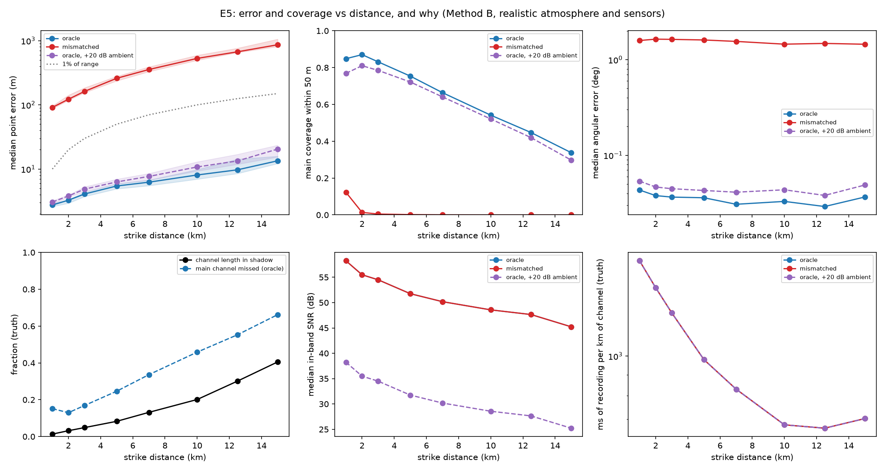
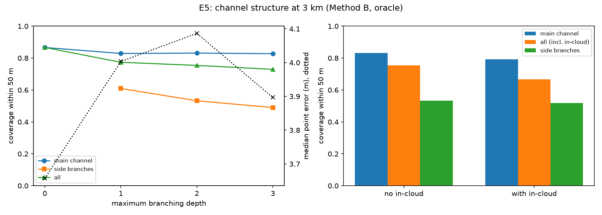

# E5: Limits

**Question.** Where does reconstruction turn to mush as distance, branching and in-cloud structure increase, and why?

## Setup

| | |
| --- | --- |
| Bolts | 24 branched bolts, the same 24 in every variant (paired). Distance sweep: the strike point fixed at 1, 2, 3, 5, 7, 10, 12.5 and 15 km |
| True atmosphere | 6.5 K/km lapse, 5 m/s west wind (power law), ISO absorption, ground reflection |
| Sensors | Realistic field kit with **absolute** ambient noise (45 dB SPL in band, VERIFY), so the SNR falls with distance as in the field |
| Method | B (best coverage in E4), 5 mics, square + center, 50 m |
| Assumed atmosphere | **oracle**: the true one, the physical limit. **mismatched**: right surface temperature, 5 K/km, no wind, the practical case |
| Robustness | +20 dB ambient (oracle). Equivalent to 100× less radiated acoustic energy, which bounds the uncertainty of the acoustic efficiency (A12) |
| Structure | Branching depth 0–3 and in-cloud on/off, at 3 km (oracle) |
| Provenance | `results/e5_limits/20261006T214427_aeb51491b28f_s20261015`, commit `739c52d`, script `scripts/e5_limits.py` |

**Diagnostics** come from the ground truth (evaluation only):
- the fraction of channel length in the refraction shadow (no eigenray reaches the array);
- the in-band SNR;
- the peak level;
- **ms of recording per km of channel**: the length-weighted 5–95% span of true arrival times, per km of heard channel. Small values mean many channel parts arrive at once.

## Distance

| Distance | Median error | Angular | Main cov. 50 m | Branch cov. 50 m | In shadow | SNR | ms per km |
| --- | --- | --- | --- | --- | --- | --- | --- |
| 1 km | 2.8 m | 0.043° | 85% | 63% | 1% | 58 dB | 1714 |
| 2 km | 3.3 m | 0.038° | 87% | 57% | 3% | 55 dB | 1472 |
| 3 km | 4.1 m | 0.037° | 83% | 53% | 5% | 54 dB | 1277 |
| 5 km | 5.4 m | 0.036° | 75% | 50% | 8% | 52 dB | 980 |
| 7 km | 6.2 m | 0.031° | 66% | 38% | 13% | 50 dB | 829 |
| 10 km | 8.1 m | 0.033° | 54% | 29% | 20% | 49 dB | 678 |
| 12.5 km | 9.7 m | 0.029° | 45% | 19% | 30% | 48 dB | 665 |
| 15 km | 13.4 m | 0.037° | 34% | 12% | 41% | 45 dB | 702 |

Oracle, Method B. Mismatched and +20 dB rows: `results/.../e5_summary.md`.

| Where it turns to mush | Oracle | +20 dB ambient | Mismatched |
| --- | --- | --- | --- |
| Main coverage within 50 m falls below 50% | **11.0 km** | 10.5 km | already at 1 km (12%) |
| Median error exceeds 1% of range | beyond 15 km | beyond 15 km | already at 1 km (91 m) |

*In the SNR panel the oracle and mismatched curves coincide (same recordings).*

**Why it turns to mush.**

1. **Accuracy doesn't degrade; it only scales with range.**
   - **Angular error:** flat at 0.03–0.04° from 1 to 15 km, so point error grows in proportion to range (2.8 m → 13 m, under 0.1% of range).
   - **Whatever is reconstructed at 15 km is as good, in angle, as at 1 km.** The SNR stays at 45 dB or more at every distance.
2. **Coverage is lost to two effects of similar size.**
   - **The refraction shadow:** the lapse rate bends sound upward, so low, distant parts of the channel have no ray to the array. The shadow fraction grows from 1% to 41% of the channel.
   - **Overlapping arrivals:** path-length differences between channel parts shrink with range, so the channel compresses in time from 1.7 to 0.7 s per km. More parts share each analysis window, and even B's three-sources-per-window limit can't keep up.
   - **Size of each:** at 15 km the main channel missed (66%) is about 1.6× the shadow fraction (41%). Roughly two thirds of the loss is sound that never arrives; the rest is sound that arrives jumbled.
3. **Noise and absorption aren't the limit at these ranges.**
   - **Noise:** 20 dB more ambient noise (equivalently, 100× weaker thunder) moves the 50% coverage point only from 11.0 to 10.5 km, and costs about 5–8 points of coverage and 10–50% of accuracy.
   - **Absorption:** it lowers the received level (136 → 111 dB SPL peak) but leaves plenty of in-band signal.
   - **Sensitivity check:** the conclusion survives the main amplitude uncertainty (acoustic efficiency, A12).
4. **An unknown atmosphere is worse than any distance.**
   - **Error:** the mismatched assumption (no wind knowledge) makes a constant 1.5° direction error. The point error therefore grows with range at about 6% of range (91 m at 1 km, 860 m at 15 km), and coverage within 50 m is near zero beyond 1 km.
   - **The practical range:** it is set by how well the wind is known (E3), not by acoustics.

## Branching depth (3 km, oracle)

| Max depth | Branches per bolt | Median error | Main cov. | All cov. | Branch cov. | ms per km |
| --- | --- | --- | --- | --- | --- | --- |
| 0 | 0 | 3.7 m | 87% | 87% | — | 1803 |
| 1 | 5.7 | 4.0 m | 83% | 77% | 61% | 1332 |
| 2 (default) | 6.9 | 4.1 m | 83% | 75% | 53% | 1277 |
| 3 | 7.8 | 3.9 m | 83% | 73% | 49% | 1181 |

- **Main channel:** it is barely affected (87% → 83%).
- **Branches:** each extra level adds smaller, weaker branches (energy and length decay per level), and those are recovered less often. Branch coverage falls from 61% (first-order only) to 49% (depth 3).
- **Mechanism:** the same overlap effect. Branches add sound to the same time span (1.8 → 1.2 s per km), and a weak branch arriving with the main channel is the source a window is most likely to miss.

## In-cloud sections (3 km, oracle)

| In-cloud | Channel length | Median error | Main cov. | All cov. | Branch cov. |
| --- | --- | --- | --- | --- | --- |
| No | 8.4 km | 4.1 m | 83% | 75% | 53% |
| Yes (4.9 km in cloud) | 14.3 km | 4.3 m | 79% | 67% | 52% |

- **Effect:** a 5 km near-horizontal in-cloud section costs 4 points of main coverage and 8 of all-channel coverage, with unchanged accuracy.
- **Why:** it sits at 5–7 km altitude, so its sound arrives at the same time as the upper main channel (arrival span 1.28 → 1.02 s per km).

## Bottom line

| Situation | Practical limit |
| --- | --- |
| Atmosphere known | Accurate to about 0.04° (under 0.1% of range) at any tested distance. Main-channel coverage above 50% out to about 11 km |
| Mainly limited by | The refraction shadow and overlapping arrivals. Not noise or absorption |
| Atmosphere unknown | The range is limited by wind knowledge, at about 6% of range error |

## Limitations

- **One atmosphere:** a single lapse rate and wind. A temperature inversion would shrink the shadow, and a stronger lapse rate would grow it.
- **No diffraction:** diffraction into the shadow is not modeled (A34). Real thunder from shadowed channel parts may be faintly audible.
- **One array:** a larger aperture would improve far-range angles (E2), at its coverage cost.
