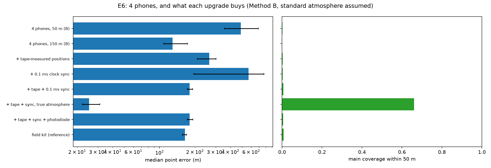

# E6: Consumer-hardware feasibility

**Question.** Could someone do this with 4 phones? What is still recoverable, and which upgrade buys the most?

**Answer.**
- **As-is: no.** Four phones placed with phone GPS and synced by a hand clap give roughly 0.5 km median error, and on most bolts only a handful of points pass the quality gates.
- **The decisive upgrade is knowing where the phones are.** Positions measured with a tape and compass, plus clocks synced to about 0.1 ms, bring phones to the professional field kit's level (180 m vs 165 m). What's left is the unknown wind, as for any array.
- **With the atmosphere known, those same phones reach 25 m** and recover 71% of the main channel.

## Setup

| | |
| --- | --- |
| Bolts | 30 at 1–3 km (tortuous, branched, in-cloud), the same 30 in every variant (paired comparisons) |
| True atmosphere | As in E4: 6.5 K/km lapse, 5 m/s west wind, ISO absorption, ground reflection |
| Assumed atmosphere | Standard: right surface temperature, 6.5 K/km, no wind |
| Phones | 4 on a 50 m square. `phone` mic preset (100 Hz high-pass, 32 dB SPL self-noise, 16-bit). Clocks aligned by a hand clap (3 ms offsets, 20 ppm drift). Flash time from 30 fps video (uniform ±16.7 ms). Phone GPS positions (3 m horizontal, 5 m vertical). 45 dB SPL ambient, 3 m/s wind noise |
| Method | B (most coverage in E4); Method D (self-calibrating, noise priors matching each setup) for error-bar honesty |
| Provenance | `results/e6_consumer/20261008T165703_9b368dd12d90_s20261006`, commit `4b1925f` (bit-for-bit reproducible), script `scripts/e6_consumer.py` |

## The upgrade ladder

| Setup | Median error | vs phones (paired) | Angular | Bolts with any point | Points per bolt (median) |
| --- | --- | --- | --- | --- | --- |
| 4 phones, 50 m | 490 m [355, 691] | 1 | 5.7° | 24/30 | 5 |
| 4 phones spread over 150 m | 129 m [108, 173] | 0.25 | 1.7° | **7/30** | 0 |
| + 0.1 ms clock sync | 569 m [195, 768] | 0.92 | 7.0° | 20/30 | 4 |
| + tape-measured positions (10 cm) | 264 m [210, 301] | 0.51 | 3.0° | 17/30 | 14 |
| **+ tape + 0.1 ms sync** | **180 m [172, 191]** | **0.37** | 2.0° | 30/30 | 205 |
| + tape + sync + photodiode flash | 180 m [172, 192] | 0.37 | 2.0° | 30/30 | 205 |
| Field kit (reference: measurement mics, GPS clocks, survey) | 165 m [156, 169] | 0.34 | 2.0° | 30/30 | 225 |
| **+ tape + sync, true atmosphere** | **25 m [22, 31]** | **0.06** | 0.36° | 30/30 | 207 (71% main coverage) |

Brackets are 95% bootstrap CIs over bolts. "Points per bolt" counts reconstructed points after the method's quality gates.

**Findings.**

1. **Phone GPS positions are the limiting factor.**
   - **Why:** a 3 m position error on a 50 m array corrupts every time difference by up to about 9 ms, far beyond what the plane-wave fits tolerate.
   - **Result:** almost every analysis window fails its consistency gates, typically 5 points per bolt instead of about 200.
   - **Sync alone doesn't help** (0.92×). With positions this bad, better clocks change nothing.
   - **Tape-measured positions alone** halve the error and triple the points.
2. **Positions and sync together reach field-kit quality.** Tape plus 0.1 ms sync gives 180 m, against the field kit's 165 m, and every bolt is reconstructed. The remaining difference is the phones' 100 Hz high-pass, which removes part of thunder's 10–300 Hz band. (Consistent with E3: about 12 cm positions and 0.4 ms sync for 20 m when the atmosphere is known.)
3. **Spreading the phones out trades coverage for accuracy.** At 150 m the angular error drops 3.4× (1.7° vs 5.7°), because position and sync errors shrink relative to the baseline. But only 7 of 30 bolts keep any point: waveforms decorrelate across long baselines (E2).
4. **Flash timing from video is good enough.** The photodiode changes nothing (180 vs 180 m). A ±17 ms flash time shifts ranges by about 6 m, small next to everything else (E3).
5. **What remains is the atmosphere, for phones and professional kit alike.** With the wind known, upgraded phones reach 25 m. Without it, everything sits at about 170–180 m. That is the self-calibration problem of E7.

**Method D: honest error bars, and the best accuracy once the phones are upgraded.**
- **Method B** reports covariances only as a by-product: its 1/2/3σ coverage is near 0.
- **Upgraded phones** (tape + 0.1 ms sync): Method D self-calibrates the atmosphere and the array (per-mic clock and position offsets).
  - **Accuracy:** **163 m** [147, 168], the best phone result without a wind measurement. It beats Method B (180 m) and matches the field kit (165 m).
  - **Error bars:** nearly honest, **0.53 / 0.87 / 0.93** against 0.20 / 0.74 / 0.97 nominal.
- **Raw phones:** Method D treats the metre- and millisecond-level array errors as noise (`d_array_calibration: false`). Result: 528 m, error bars 0.25 / 0.54 / 0.71, no better than B.
- **Why array calibration is off for raw phones:** with it on, a single bolt cannot constrain 20 array parameters with ±4 m and ±3 ms priors. An earlier run (commit `a0ff2aa`) gave 1,548 m and overconfident bars (0.04 / 0.12 / 0.16). Array calibration is for survey-grade arrays.

## What you could do with 4 phones

| Goal | What it takes |
| --- | --- |
| Rough direction to the strike (a few degrees) | Phones as they are: a few points on most bolts |
| A reconstruction comparable to professional gear | Measure the phone positions (tape and compass, about 10 cm) and sync to about 0.1 ms (VERIFY: e.g. GPS-time apps or a shared chirp recorded by all phones) |
| Tens of meters | Additionally, know the wind profile (a weather balloon, a nearby sounding, or self-calibration from several bolts at different azimuths: E7) |

## Limitations

- **One geometry:** a single 4-phone layout (a square). A phone mast or a fifth phone would add redundancy.
- **Phone signal processing:** phone automatic gain control and noise suppression are not modeled (A17). Either would degrade timing further.
- **The sync figure is an assumption:** the 0.1 ms sync level is a plausible app-level figure (VERIFY), not a measured one.
