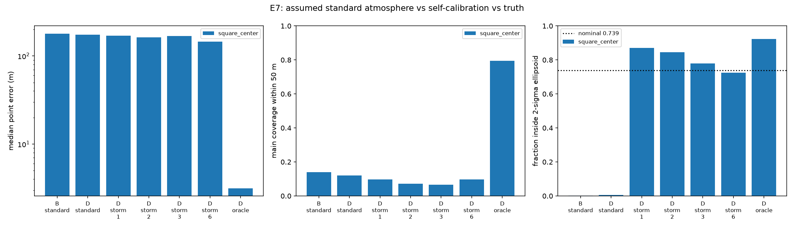
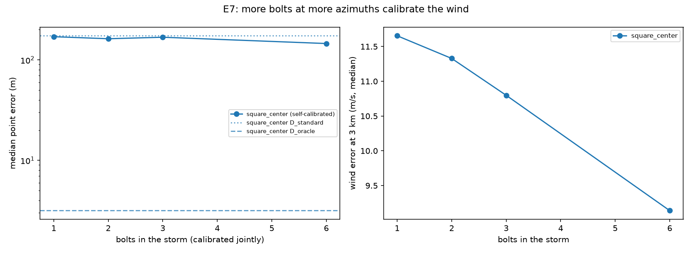
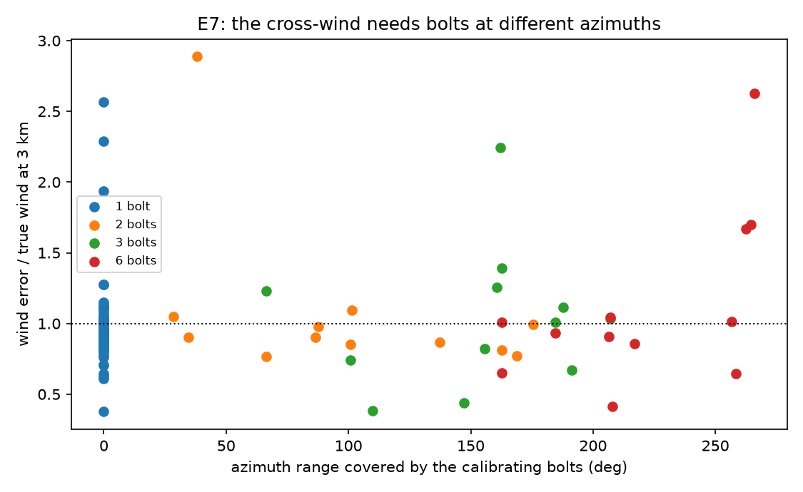
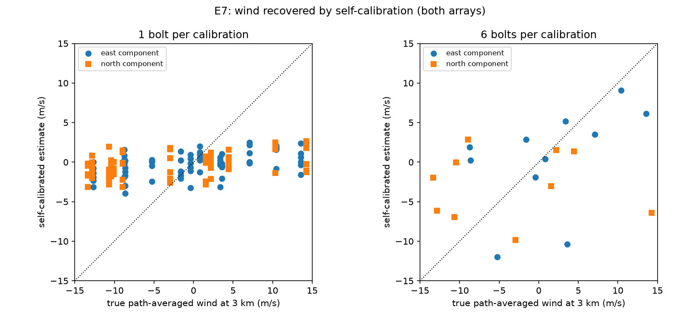
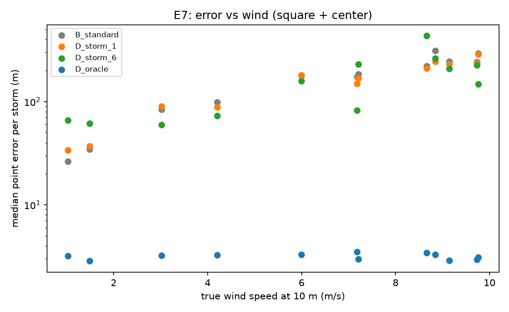

# E7: Self-calibration

**Question.** Method D estimates the sound speed and the wind jointly with the channel. How well does it recover the true atmosphere, and how much does that improve accuracy over assuming a standard atmosphere?

**Answer.**
- **Sound speed and lapse rate: recovered well.** The height gradient of the path-averaged sound speed is within about 0.2–0.3 m/s per km.
- **Error bars: honest once the array is calibrated too.** That means estimating per-mic clock and position offsets alongside the atmosphere.
- **Wind: not recovered on realistic recordings.** The errors are about 9 m/s against a true 12.6 m/s at 3 km, so accuracy improves only modestly over the standard atmosphere (6-bolt storms: 146 m vs 174 m median).
- **What it does in controlled conditions:** storm self-calibration does recover the wind (development storm: 13–24 m vs 82–317 m).
- **Why it degrades on realistic data:** the experiment traces this to per-mic systematic errors and to model misspecification. Both are diagnosed below.

## Setup

| | |
| --- | --- |
| Storms | 12, each with 6 bolts at random azimuths and 1–3 km (tortuous, branched, in-cloud) |
| True atmosphere per storm | Wind 0–10 m/s at 10 m from a random direction, veer ±20°/km, lapse rate 4.5–8.5 K/km; humidity, ISO absorption, ground reflection |
| Assumed by every method | Standard atmosphere: right surface temperature, 6.5 K/km, no wind |
| Sensors | Realistic field kit (measurement mics, GPS-synced clocks, surveyed positions, photodiode t0, 45 dB SPL ambient, 3 m/s wind noise); 5 mics, square + center, 50 m |
| Variants, on the same recordings | **B_standard**: Method B with the standard atmosphere. **D_standard**: Method D, standard atmosphere fixed. **D_storm_n**: Method D self-calibrating from the first n bolts of the storm jointly (n = 1: each bolt alone). **D_oracle**: Method D with the true atmosphere |
| Truth for atmosphere recovery | The true atmosphere's path-averaged sound speed and wind, linear in source height (the same parameterization D estimates); wind compared for a source at 3 km |
| Provenance | Main run `results/e7_self_calibration/20261008T055410_b321b47716aa_s20261007` (commit `f581407`, with array calibration). Earlier run without array calibration: `.../20261007T225910_b321b47716aa_s20261007` (commit `a9b6a9f`, which also has a mast array). Script `scripts/e7_self_calibration.py` |

## Results (square + center array, with array calibration)

| Variant | Median error | Main coverage (50 m) | Error-bar coverage 1/2/3σ (nominal 0.20 / 0.74 / 0.97) | CPU per bolt |
| --- | --- | --- | --- | --- |
| B, standard atmosphere | 179 m [98, 228] | 14% | 0.00 / 0.00 / 0.01 | 5.9 s |
| D, standard atmosphere fixed | 174 m [97, 231] | 12% | 0.00 / 0.00 / 0.01 | 33 s |
| D, self-calibrating each bolt | 170 m [90, 206] | 10% | 0.38 / 0.87 / 0.93 | 9.7 s |
| D, storm of 2 bolts | 163 m [119, 202] | 7% | 0.32 / 0.85 / 0.92 | 5.7 s |
| D, storm of 3 bolts | 168 m [111, 217] | 7% | 0.35 / 0.78 / 0.92 | 6.0 s |
| **D, storm of 6 bolts** | **146 m [78, 201]** | 10% | **0.40 / 0.73 / 0.86** | 6.3 s |
| D, true atmosphere (oracle) | 3.2 m [3.0, 3.3] | 79% | 0.63 / 0.92 / 0.97 | 42 s |

Brackets are 95% bootstrap CIs, resampling whole storms (bolts in a storm share the atmosphere). The oracle's error bars are conservative because the score uses the distance to the *nearest* channel point.

| Bolts calibrated jointly | Wind error at 3 km | Sound-speed gradient error | Wind z-score (rms) |
| --- | --- | --- | --- |
| 1 | 11.7 m/s | 0.25 m/s per km | 1.03 |
| 2 | 11.3 m/s | 0.29 m/s per km | 1.01 |
| 3 | 10.8 m/s | 0.26 m/s per km | 1.02 |
| 6 | 9.1 m/s | 0.21 m/s per km | 1.24 |

The median true wind at 3 km is 12.6 m/s.

**Findings.**

1. **With the standard atmosphere, error bars are badly overconfident.**
   - **Result:** Method D with the atmosphere fixed reports metre-scale ellipsoids, and almost none contain the truth (coverage 0.00–0.01). The unknown wind's error isn't in its model.
   - **With self-calibration:** the medium's uncertainty propagates into every point, and coverage rises to 0.73–0.87 at 2σ against 0.74 nominal.
   - **This is Method D's main practical value:** an honest statement of how well each point is known.
2. **The sound-speed profile is recovered; the wind is not.**
   - **Lapse rate:** recovered to about 0.25 m/s per km from a single bolt.
   - **Wind:** errors of 9–12 m/s for winds of about 12.6 m/s, although the z-scores near 1 show D knows it.
   - **Accuracy:** six bolts at different azimuths reduce the median error from 174 m to 146 m (16%).
3. **Why one bolt cannot measure the wind.**
   - **The geometry:** sound from one bolt reaches the array over a narrow range of azimuths. Only the wind along the line of sight changes anything measurable. A cross-wind shifts every apparent source sideways in proportion to its travel time, which looks exactly like a slightly different channel.
   - **What a storm adds:** bolts at other azimuths see that cross-wind component along their own line of sight.
   - **In controlled conditions this works:** with ideal sensors, a development storm of 4 bolts at 0, 90, 180 and 270° (6 m/s wind, still-air prior) gave 13–24 m against 80–98 m per bolt, and the wind came out at (9.6, 3.2) m/s against the true (8.5, 3.1).
   - **Diversity matters more than bolt count:** in a smoke-test storm with bolts at 90, 150 and 156°, the true and the found wind were indistinguishable (objective within 0.2%).

   
4. **Why realistic data defeats it (isolation study on one calm storm, true wind 1 m/s, run before array calibration existed).**

   | Synthesis and sensors | 6-bolt storm self-calibration error |
   | --- | --- |
   | No sensor errors | 6–15 m (wind recovered) |
   | Microphone tolerances only | 18–60 m |
   | Noise only | 12–53 m |
   | Survey-grade mic positions only (1–2 cm) | 94–159 m |
   | Full realistic kit | 91–181 m |

   - **The mechanism:** per-mic errors are the same in every window. Treated as independent noise, they are pooled over hundreds of windows and absorbed by the few shared medium parameters, so even 2 cm (about 60 µs) of position error invents several m/s of wind.
   - **The fix, now in Method D:** per-mic clock and 3-D position offsets are parameters, with priors from the stated hardware accuracy (synthetic test: recovers 2 cm offsets and the wind).
   - **The trade-off:** array calibration makes the error bars honest (2σ coverage 0.40 → 0.73) and stops self-calibration from damaging calm storms. But the mic offsets and the wind both shift arrival times in direction-dependent ways, so they compete for the same signal:

   | Median error | Calm storms (< 4 m/s) | Windy storms |
   | --- | --- | --- |
   | Standard atmosphere | 35 m | 225 m |
   | Storm self-calibration, without array calibration | 170 m | 104 m |
   | Storm self-calibration, with array calibration | 62 m | 209 m |

   - **A remaining model limit:** even without sensor errors, the likelihood preferred a slightly wrong wind over the truth (objective 268 vs 282). The straight-ray, linear-in-height moving medium plus extended-source window systematics leave structure that the weakly constrained wind absorbs.

   
   

5. **A raised mic suffers from ground reflection** (earlier run, mast array). With ground reflection on, even the oracle reaches only 8.5 m and 36% coverage on the mast array, against 3.2 m and 79% on the flat array.
   - **Why:** the echo off the ground reaches a 10 m-high mic up to about 58 ms after the direct sound, a separate arrival that changes its waveform. At 1.5 m the echo arrives within a few ms and overlaps the direct sound, so all ground mics hear similar waveforms.
   - **Why E2 missed it:** E2 ran without ground reflection, so it rated the mast neutral. With reflection the mast is clearly worse, which strengthens E2's advice against masts.

## Recommendation

| Situation | Approach |
| --- | --- |
| Error bars that mean something | Method D with self-calibration (and array calibration): coverage near nominal |
| Accuracy without a wind measurement | Self-calibration gives a modest gain (about 16%), mostly from the sound-speed profile |
| Accuracy at the oracle level (3 m) | Measure the wind: a surface anemometer plus a sounding (radiosonde, a nearby weather model) as Method D's prior |
| Future work | Storms with wide azimuth coverage; a refracting (ray-traced) medium inside the self-calibration; per-window weighting that discounts windows dominated by overlapping sources |

## Limitations

- **Small sample:** 12 storms. The storm-level CIs are wide.
- **Wind profile:** a power law with linear veer. Real profiles (low-level jets, inversions) would be harder.
- **Effective medium:** straight rays with height-linear path averages; it is adequate when its parameters are right (1.4 m in still air, 7.7 m in 6 m/s wind, development bolt), but not ray-traced.
