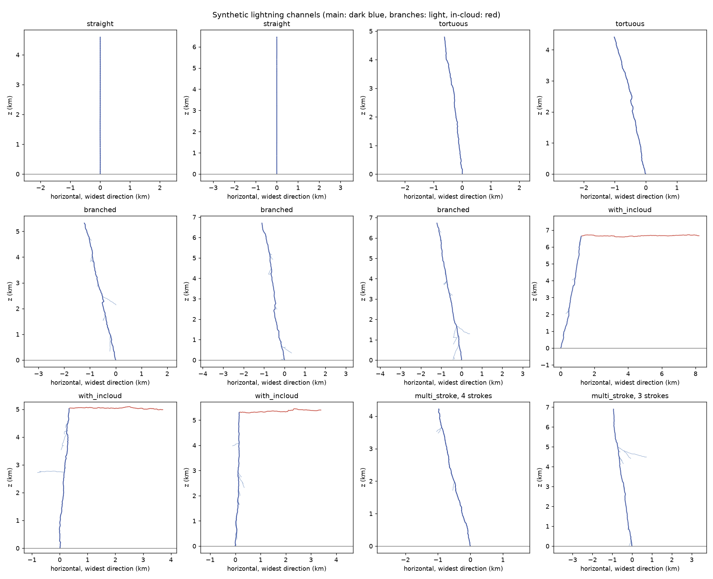

# M1: channel generator statistics

100 channels per preset, mean ± standard deviation. Regenerate with `python scripts/make_channel_gallery.py configs/experiments/channel_gallery.yaml` (seed 1).

The configured turn-angle mean is 16° (1° for `straight`).

| preset | turn_mean_deg | total_length_m | main_length_m | incloud_length_m | branch_count | horizontal_extent_m | fractal_dimension | n_strokes |
| --- | --- | --- | --- | --- | --- | --- | --- | --- |
| straight | 1.00 ± 0.03 | 5492.43 ± 858.64 | 5492.43 ± 858.64 | 0.00 ± 0.00 | 0.00 ± 0.00 | 5.52 ± 1.22 | 0.95 ± 0.01 | 1.00 ± 0.00 |
| tortuous | 16.05 ± 0.50 | 6007.24 ± 950.66 | 6007.24 ± 950.66 | 0.00 ± 0.00 | 0.00 ± 0.00 | 791.38 ± 431.63 | 1.04 ± 0.01 | 1.00 ± 0.00 |
| branched | 16.07 ± 0.43 | 8670.21 ± 2182.92 | 6075.31 ± 929.09 | 0.00 ± 0.00 | 7.84 ± 4.28 | 1017.78 ± 418.84 | 1.14 ± 0.05 | 1.00 ± 0.00 |
| with_incloud | 15.98 ± 0.31 | 14495.61 ± 2677.60 | 6553.51 ± 623.97 | 4927.50 ± 1784.98 | 9.27 ± 4.09 | 5035.00 ± 1707.16 | 1.11 ± 0.04 | 1.00 ± 0.00 |
| multi_stroke | 15.93 ± 0.37 | 8631.93 ± 1984.60 | 5847.83 ± 876.66 | 0.00 ± 0.00 | 8.26 ± 3.41 | 1082.71 ± 406.47 | 1.15 ± 0.04 | 3.03 ± 0.83 |

