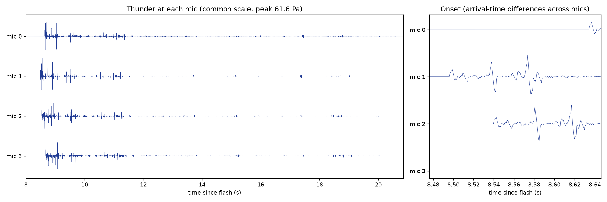
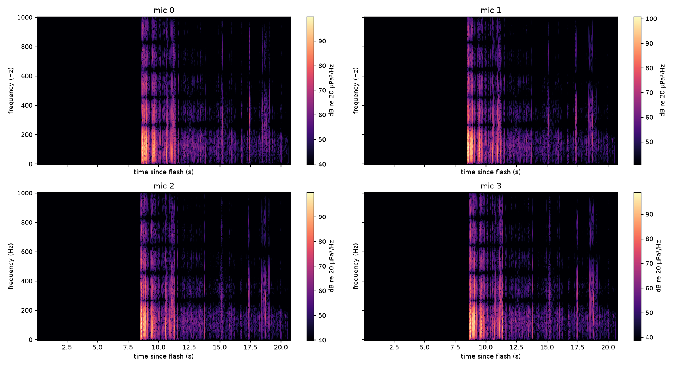
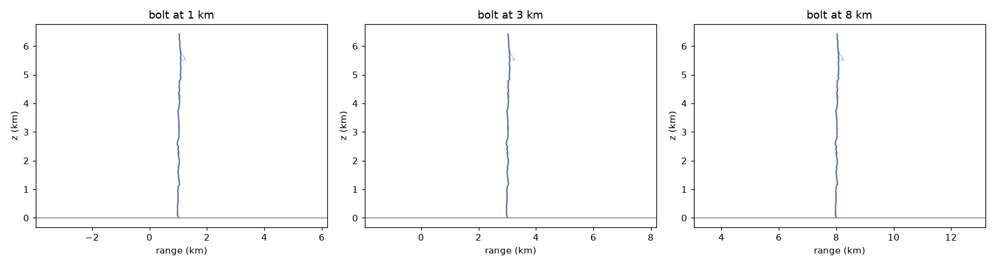

# M2: thunder synthesis (uniform atmosphere)

Regenerate with `python scripts/make_synthesis_demo.py configs/experiments/synthesis_demo.yaml` (seed 2). This writes figures, 4-mic WAVs, and single-mic WAVs at 1, 3 and 8 km.

## Validation (all in `tests/test_synthesis.py`)

| Check | Result |
| --- | --- |
| N-wave spectral peak vs Few's f_peak | within 0.5% (123 Hz at 1×10⁶ J/m, 25 °C) |
| Point source: arrival time | within one output sample (0.125 ms) |
| Point source: 1/r amplitude | energy ratio at r and 2r = 2.00 ± 1% |
| Vertical line (D = 2 km, H = 3 km) | first arrival at D/c within 1.5 ms; last arrival at √(D²+H²)/c, ending within T + 2 ms |
| 100 m horizontal segment, side-on vs end-on energy | 9,200× (straight), 3,070× (with micro-tortuosity) |
| Rumble duration vs (r_max − r_min)/c | within 5% |
| Spectrum peak, branched bolt at 3 km | 20–300 Hz (measured 92–129 Hz across 1–8 km) |
| Energy flux from a 12 km line vs ηE_ℓ | within 0.5% |
| Emitter spacing 1 m vs 0.1 m | under 1% difference |

## Levels (η = 0.002, VERIFY)

| Distance | Peak pressure | Recording length |
| --- | --- | --- |
| 1 km | 139 Pa | 19 s |
| 3 km | 47 Pa | 21 s |
| 8 km | 31 Pa | 30 s |

