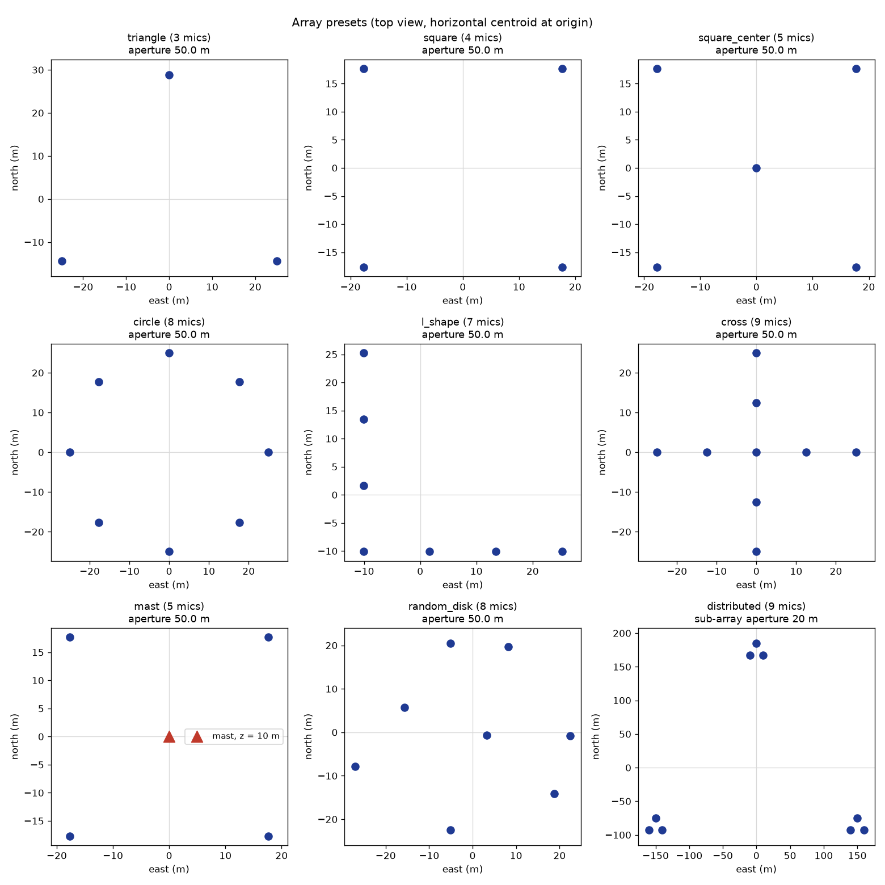
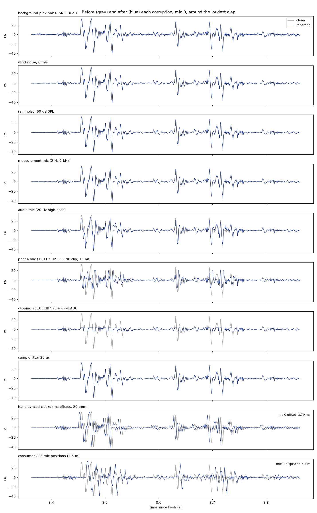
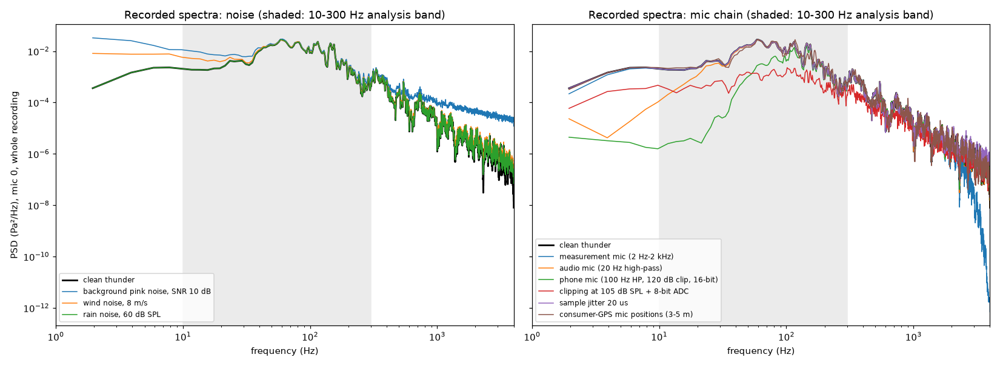

# M3: sensors and arrays

Regenerate with `python scripts/make_sensor_demo.py configs/experiments/sensor_demo.yaml` (seed 3).

## Validation (all in `tests/test_sensors.py`, 39 tests)

| Check | Result |
| --- | --- |
| All corruptions off | output bit-identical to clean |
| Known clock offset (1.37 ms = 10.96 samples) | cross-correlation peak within 0.05 samples; matches an FFT fractional delay within 1% |
| Clock drift + offset | arrival at (1 + δ)·r/c + o within one sample |
| Configured SNR (0, 10, 25 dB) | exact by construction (1e−6 dB); independent Welch estimate within 0.5 dB |
| Noise PSD and color | level within 2%; pink slope −1.00, brown −1.99 |
| Diffuse coherence | matches sinc²(2fd/c) within 0.03 |
| Wind noise | RMS within 3% of the model; scales as U²; incoherent at 10 m |
| Rain / self-noise level | exact RMS / density within 5% |
| Mic filters | −3.01 dB at the corner (including per-mic corner error); 0 dB in the passband |
| Clipping / ADC | bounded by full scale; integer codes; error ≤ ½ LSB |
| Jitter | error RMS = σ·RMS(x′) within 5% |
| Flash-time presets | σ and bounds within 5% |
| Array layouts (10 cases) | exact aperture, zero centroid, correct heights, no coincident mics |
| Position and clock statistics | σ within 5%; common clock shared; error streams independent |

## Effect of mic presets on a branched bolt

| Distance | Measurement | Audio | Phone |
| --- | --- | --- | --- |
| 1 km | −0.2% energy | −22%, clips 0.02% of samples | −71%, clips 0.17% |
| 3 km | −0.2% | −3.4% | −45% |
| 8 km | −0.2% | −3.5% | −50% |

## Flash-time error as range error (σ)

| Preset | t0 error σ | Range error σ |
| --- | --- | --- |
| Photodiode | 10 µs | 3 mm |
| Lightning network | 1 ms | 0.35 m |
| 30 fps video (frame-center convention) | 9.6 ms | 3.3 m |

