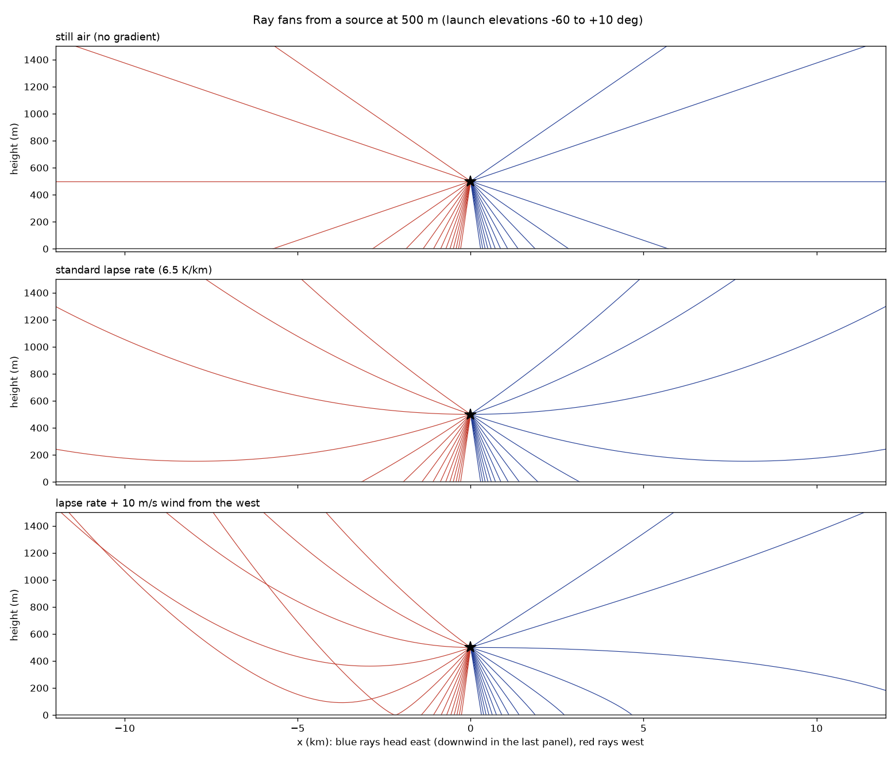
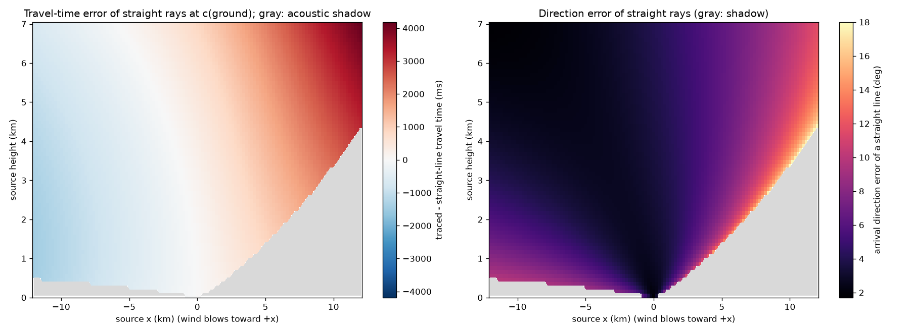
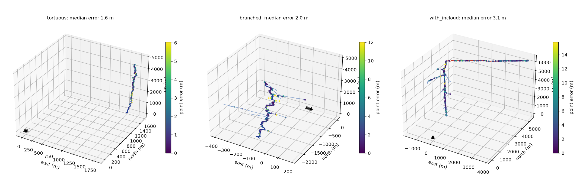
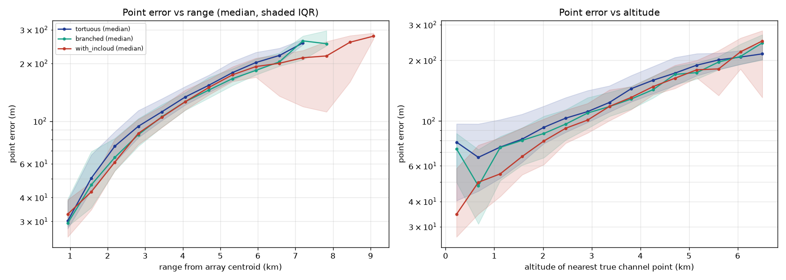
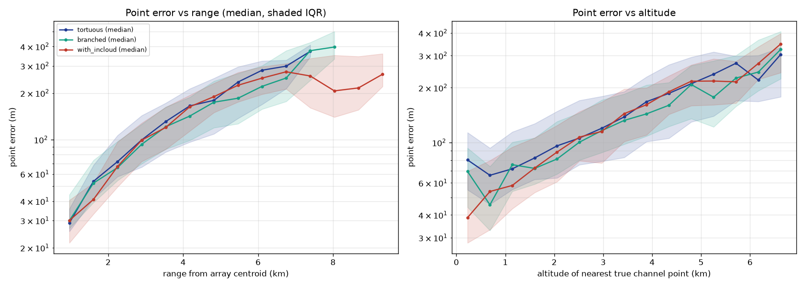

# M5: realistic atmosphere

**What M5 adds.**
- **Atmosphere:** a layered atmosphere with a lapse rate, optional inversion, humidity and power-law wind.
- **Propagation:** exact ray tracing through it, ISO 9613-1 absorption, and ground reflection.
- **Reconstruction:** a version of Method A that traces the measured sound back through an *assumed* atmosphere along bent rays.

Regenerate the figures with `python scripts/make_atmosphere_figures.py configs/experiments/atmosphere_figures.yaml`, and the experiment with `python scripts/run_experiment.py configs/experiments/m5_atmosphere_<oracle|mismatched|straight>.yaml`.

## Validation (tests/test_atmosphere.py, 25 tests)

| Check | Result |
| --- | --- |
| Uniform still air: traced vs straight-line travel time (spec: 0.1%) | within 1e-6 relative (measured 1e-11) |
| Uniform still air: spreading vs 1/R (with ρc impedance) | within 1e-5 |
| Standard lapse rate: shadow-zone distance vs circular-ray theory √(2R_cH − H²) | within 2% |
| Downwind arrives earlier than upwind at equal distance | yes |
| Fast eigenray solver vs independent `solve_ivp` ray tracer | landing within 0.5 m, time within 0.1 ms, dispersion relation held to 5e-6 |
| Node-plus-Hermite emitter times vs exact per-emitter rays | max 0.23 µs; identical shadow sets |
| Back-trace (`locate`) inverts `propagate` | within 0.5 m (with and without wind) |
| Layer weights vs quadrature | 1e-9 |
| Pressure vs barometric formula; U.S. Standard Atmosphere value at 5 km | 1e-8; 54,020 Pa |
| ISO 9613-1 implementation vs ISO 9613-2 Table 2 (4 conditions, 8 octave bands) | within table rounding |
| Synthesized absorption vs α(f)·L | within 0.5 dB |
| Ground reflection: echo delay and level | delay within 1 sample, level R/R' within 2% |
| Oracle refraction-aware Method A through wind | median error under 10 m, versus over 5× that with straight rays |

## Ray fans and straight-line errors

- **Still air:** rays are straight.
- **Standard lapse rate:** rays curve upward, creating the acoustic shadow.
- **10 m/s west wind:** upwind (westbound) rays curve up sharply, and downwind rays bend down toward the ground.

The cost of assuming straight rays at the ground sound speed, with the 6.5 K/km lapse rate plus 10 m/s wind:
- **Travel time:** up to 4.2 s off at 12 km range and 7 km height.
- **Direction:** a median 4° off, and up to 18° near the shadow boundary.
- **Shadow:** 15% of this source grid is in the acoustic shadow, mostly upwind.

## Does reconstruction survive a realistic atmosphere?

Setup:
- **Bolts:** the same 60 bolts at 1–3 km (tortuous, branched and in-cloud presets).
- **Synthesis atmosphere:** 25 °C at the ground, 6.5 K/km lapse rate, 50% relative humidity, 5 m/s wind from the west at 10 m, ISO absorption, and rigid-ground reflection.
- **Sensors and method:** ideal sensors (this isolates the atmosphere), with Method A.

| Reconstruction assumes | Median error | 90th percentile | Radial / transverse (median) | Main channel within 50 m | Strike error (median) |
| --- | --- | --- | --- | --- | --- |
| The true atmosphere (**oracle**, upper bound) | **1.7 m** [1.6, 1.9] | 5.0 m | 0.9 / 1.2 m | 83% | 33 m |
| Correct ground temperature, lapse 5 K/km, **no wind** (spec option c, realistic) | **137 m** [128, 144] | 219 m | 41 / 127 m | 3% | 68 m |
| Straight rays at the ground sound speed (spec option a) | **153 m** [134, 171] | 299 m | 39 / 144 m | 4% | 63 m |

Brackets are 95% cluster-bootstrap CIs.

**Findings.**
1. **Refraction-aware reconstruction fully undoes the atmosphere when it is known.** Through lapse, wind, absorption and ground reflection, the oracle error (1.7 m) matches the still-air E1 result (1.4 m). This also validates that synthesis and reconstruction use consistent ray physics.
2. **Unknown wind dominates the realistic error.** The mismatched error is mostly transverse (127 of 137 m), which is the signature of wind drift: about 5–10 m/s for about 10 s of flight. Getting the temperature profile only roughly right already beats straight rays, mainly in the tail (90th percentile 219 vs 299 m).
3. **Error grows with range and altitude** (about 30 m at 1 km to about 400 m at 8 km, straight-ray case), as unmodeled refraction should.
4. **Implication for the plan:** on these numbers, estimating the wind is the biggest available improvement, which is E7's question (self-calibration with Method D). Method B (M6) will add the multi-source windows. With the realistic atmosphere, M5's mismatched setting is now the headline condition the spec asks for.

*Provenance:* all three runs were made with simulation code at commit `079b339`. The working tree was "dirty" only because docs and the report-description function were being edited during the runs; neither affects any simulated number.

