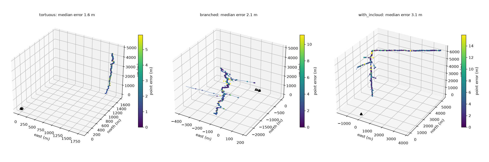
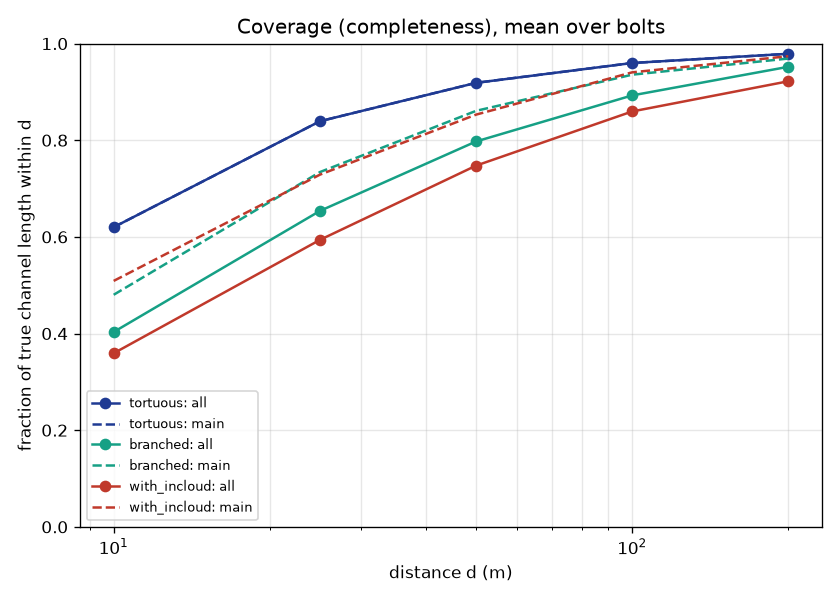
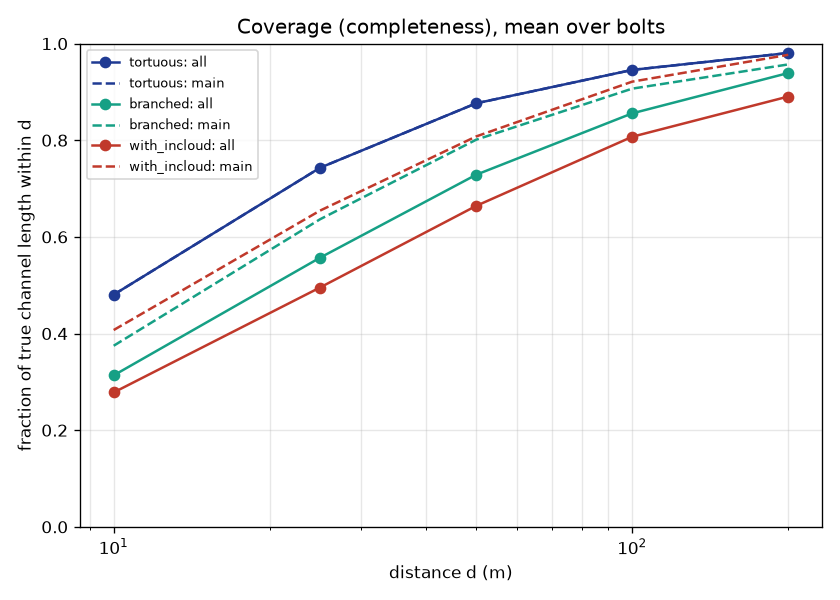

# M6: Methods B and C

**Method B** finds several sources per window. It's a steered-response-power search over horizontal slowness with β-PHAT weighting. Each peak's delays are re-measured with matched windows in a narrow search, and each detected source gets its own beam-steered arrival time.

**Method C** fits absolute arrival times through the assumed atmosphere, including the wavefront's curvature across the array. It uses robust, batched Gauss–Newton with gradients supplied by the ray solver.

All three methods share one interface (`reconstruct`) and the same delay-measurement code. Each places its points with straight rays or traced rays, according to the assumed atmosphere.

## Gate tests (tests/test_methods.py, 11 tests)

| Check | Result |
| --- | --- |
| Two equally strong simultaneous sources 90° apart (spec gate) | **B finds both**: direction error 0.01° each, range within 1%. A finds neither (its one-direction fit fails). |
| Single point source, B and C | direction within 0.5°, range within 1% |
| 300 m distributed array, source 900 m away (wavefront curvature) | C within 1 m. A's plane-wave fit is rejected by its residual gate. |
| Multilateration through 8 m/s sheared wind, 40 m perturbed start | converges to within 5 cm |
| β-PHAT correlation of a signal with itself, any β and any level | peak exactly 1 (fixes the M4 normalization bug) |
| Mismatched-atmosphere runs (spec gate) | A, B and C all run. With the true atmosphere each is under 10 m; with the mismatched one, errors are larger, as they should be. |

## Comparison on the M5 realistic-atmosphere bolts

Setup:
- **Bolts:** the same 60 bolts at 1–3 km (tortuous, branched, in-cloud).
- **Synthesis atmosphere:** 6.5 K/km lapse rate, 5 m/s west wind, ISO absorption, ground reflection.
- **Sensors:** ideal, 5 mics, 50 m aperture.
- **Provenance:** all runs on clean commit `43805f8`.
- **Intervals:** brackets are 95% cluster-bootstrap CIs.

| Method | Assumed atmosphere | Median error | 90th percentile | Coverage within 50 m (all / main) | Coverage within 100 m (all) | Strike (median) | Time per bolt |
| --- | --- | --- | --- | --- | --- | --- | --- |
| A | true (oracle) | 1.7 m [1.6, 1.9] | 5.0 m | 76% / 83% | 87% | 33 m | 2.2 s |
| **B** | true (oracle) | 1.8 m [1.7, 1.9] | 5.5 m | **82% / 88%** | **90%** | 36 m | 6.1 s |
| C | true (oracle) | 1.7 m [1.6, 1.9] | 5.0 m | 76% / 83% | 87% | 33 m | 19.6 s |
| A | mismatched (right T0, 5 K/km, no wind) | 137 m [128, 144] | 219 m | 3% / 3% | 27% | 68 m | 2.1 s |
| B | mismatched | 135 m [127, 143] | 221 m | 4% / 4% | 32% | 66 m | 6.2 s |
| C | mismatched | 137 m [128, 144] | 219 m | 3% / 3% | 28% | 68 m | 18.2 s |

**Findings.**
1. **B recovers more of the channel at almost the same accuracy.** Coverage rises from 76% to 82% (all channel) and from 83% to 88% (main channel), the gain coming from windows where several parts of the channel arrive together. Those were Method A's blind spots: branches and the near-vertical lower channel. The cost is 0.1 m of median error and about 3× the run time.
2. **C matches A on a compact array.** At 1–3 km, the wavefront curvature across 50 m is negligible. C's advantage is for large or distributed arrays (shown in the near-field test), which experiment E2 will explore. It is the slowest method in a stratified atmosphere, because it traces eigenrays for every mic on every iteration.
3. **With the wind unknown, no method helps.** All sit at about 136 m, mostly sideways error. A better method can't fix a wrong atmosphere; estimating the atmosphere can (E7, self-calibration).

